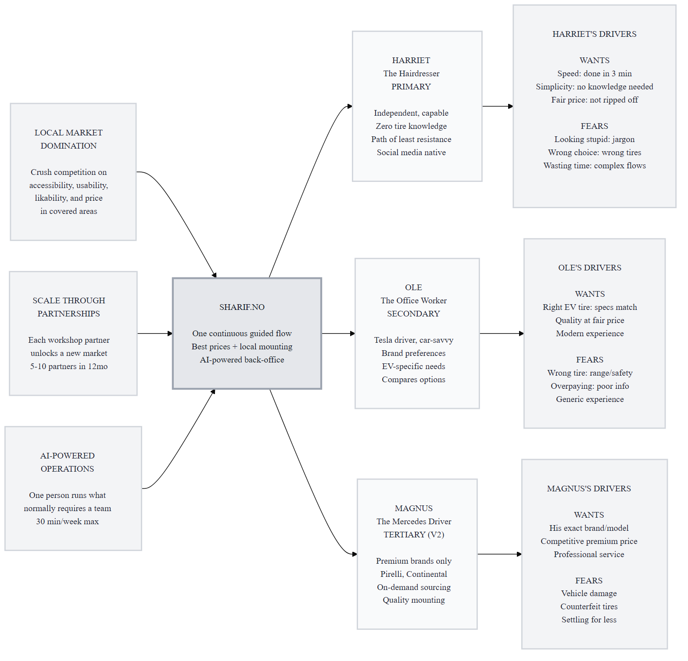
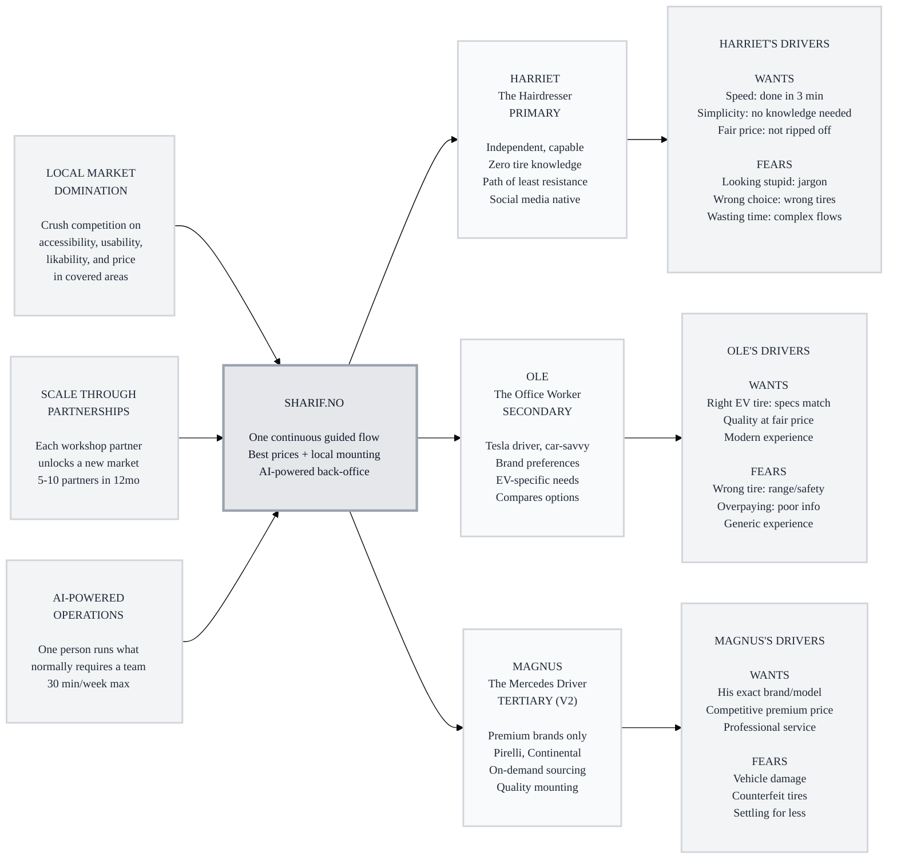

# Trigger Map Poster: Sharif.no

> Visual overview connecting business goals to user psychology

**Created:** 2026-03-26
**Author:** Saga (WDS Phase 2)
**Methodology:** Based on Effect Mapping (Balic & Domingues), adapted for WDS framework

---

## Strategic Documents

This is the visual overview. For detailed documentation, see:

- **[01-Business-Goals.md](01-Business-Goals.md)** - Full vision statements and SMART objectives
- **[02-Harriet-the-Hairdresser.md](02-Harriet-the-Hairdresser.md)** - Primary persona with complete driving forces
- **[03-Ole-the-Office-Worker.md](03-Ole-the-Office-Worker.md)** - Secondary persona
- **[04-Magnus-the-Mercedes-Driver.md](04-Magnus-the-Mercedes-Driver.md)** - Tertiary persona
- **[05-Key-Insights.md](05-Key-Insights.md)** - Strategic implications for design

---

## Vision

**Sharif.no makes buying tires the easiest thing a Norwegian car owner does all year — at prices the big chains can't match. Dominate every local market we enter through the simplest digital experience, lowest prices, and mounting included.**

---

## Business Objectives

### Objective 1: Local Market Domination (THE ENGINE)

- **Metric:** Online order volume vs. local competitors in covered areas
- **Target:** Majority of sales shift from phone to online
- **Timeline:** 3 months post-launch per area

### Objective 2: Workshop Network Expansion

- **Metric:** Number of active partner workshops
- **Target:** 5-10 partners
- **Timeline:** 12 months

### Objective 3: Operational Leverage

- **Metric:** Moohsen's time on store operations
- **Target:** < 30 minutes per week
- **Timeline:** From launch

### Objective 4: Margin Control

- **Metric:** Average margin vs. competitors
- **Target:** Lowest price position in every covered area
- **Timeline:** Ongoing

---

## Target Groups (Prioritized)

### 1. Harriet the Hairdresser

**Priority Reasoning:** She IS the volume. If the flow works for her, it works for everyone. Her word-of-mouth drives local growth.

> Independent woman, early 30s, drives a small car, doesn't care about tires. Social media native. Does everything herself. Takes the path of least resistance.

**Key Positive Drivers:**
- Speed — done in under 3 minutes
- Simplicity — no tire knowledge required
- Fair price — confidence she's not being ripped off

**Key Negative Drivers:**
- Looking stupid — jargon makes her leave
- Wrong choice — fear of buying tires that don't fit
- Wasting time — complex flows get abandoned

### 2. Ole the Office Worker

**Priority Reasoning:** Validates catalog quality, drives EV content (biggest SEO gap in Norway), higher-value orders.

> 40-something, drives a Tesla Model 3, car-savvy, compares options, may have brand preferences. Wants the right tire at a fair price.

**Key Positive Drivers:**
- Right tire for his EV — specs that match Tesla needs
- Quality at fair price — best value, not cheapest
- Efficient modern experience — matches his Tesla UX expectations

**Key Negative Drivers:**
- Wrong tire compromises range or safety
- Overpaying due to poor information
- Settling for a generic experience

### 3. Magnus the Mercedes Driver (V2)

**Priority Reasoning:** Drives V2 supplier integration, premium margin. Not in V1 — his absence is a feature, not a limitation.

> 50-something, Mercedes E-Class, wants Pirelli or Continental specifically. Brand-first buyer. Willing to pay, willing to wait.

**Key Positive Drivers:**
- His specific brand and model — no substitutes
- Competitive price on premium — 10-20% less than dealer
- Professional mounting service — his car deserves proper handling

**Key Negative Drivers:**
- Damage to his vehicle
- Counterfeit or grey market tires
- Settling for second best

---

## Trigger Map Visualization

---

## Design Focus Statement

**The Sharif.no experience transforms Norwegian car owners from resigned local-shop customers into empowered online tire buyers who get the best price with zero effort, through a continuous guided dialog — not a store.**

**Primary Design Target:** Harriet the Hairdresser

**Must Address:**
- Fear of looking stupid → No jargon, visual guides, plain language
- Fear of wrong choice → Dimension input ensures fit, only matching tires shown
- Fear of wasting time → Under 3 minutes, continuous flow, no page reloads
- Want: speed → 6 steps, one surface, done
- Want: fair price → Cheapest first, transparent pricing, no tricks

**Should Address:**
- Ole needs EV-relevant specs → EU label sliders, load rating visibility
- Ole needs brand options → Collapsed filter, available when needed
- Trust signals → 60+ year brand, real shops, real people
- Multi-channel access → API for AI agent purchasing
- Multi-language → Norwegian + English

---

## Cross-Group Patterns

### Shared Drivers
- **Fair pricing** — all three want a good deal (budget, fair, competitive)
- **No wasted time** — speed expectations differ (2min, 10min, find-exact) but all hate friction
- **Trust** — tires must be correct, safe, and properly handled

### Unique Drivers
- **Harriet:** Zero knowledge accommodation
- **Ole:** EV-specific intelligence
- **Magnus:** Brand specificity

### Potential Tensions
- **Harriet vs. Ole:** Minimal options vs. filters and specs → Resolution: collapsed filters
- **Harriet vs. Magnus (V2):** Budget vs. premium in same catalog → Resolution: price sort default, brand filter optional

---

## Next Steps

- [ ] **Phase 3: UX Scenarios** — Design the guided flow step by step
- [ ] **Validate personas** — Test assumptions with real customers if possible
- [ ] **Update as learnings emerge** — This is a living document

---

_Generated with Whiteport Design Studio framework_
_Trigger Mapping methodology credits: Effect Mapping by Mijo Balic & Ingrid Domingues (inUse), adapted with negative driving forces_
