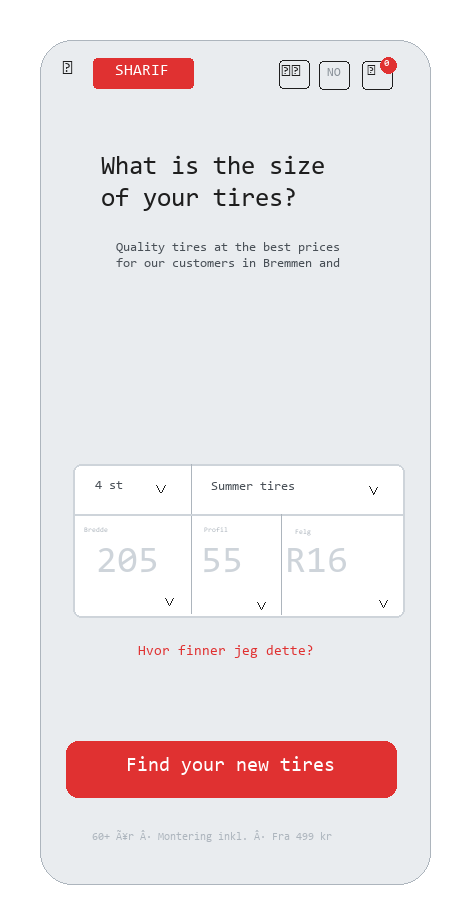

### 01.1-Dimension Input

**Previous Step:** ← (Entry point — no previous step)
**Next Step:** → [01.2-Product Cards](../01.2-product-cards/01.2-product-cards.md)



**Previous Step:** ← (Entry point — no previous step)
**Next Step:** → [01.2-Product Cards](../01.2-product-cards/01.2-product-cards.md)

   

# 01.1-Dimension Input

## Page Metadata

| Property | Value |
|----------|-------|
| **Scenario** | 01: Harriet's Tire Purchase |
| **Page Number** | 01.1 |
| **Platform** | Mobile web (responsive) |
| **Page Type** | Full Page (Next.js route: `/no`) |
| **Viewport** | Mobile-first (< 768px) |
| **Interaction** | Touch-first |
| **Visibility** | Public |
| **Framework** | Next.js 15 App Router (server component + client TireSearch) |

   

## Overview

**Page Purpose:** Harriet enters her tire dimensions — the entry point to the guided buying flow.

**User Situation:** Between clients at the salon, 5 minutes to spare, phone in hand. Tapped a geo-targeted Instagram ad. Never looked at a tire sidewall before.

**Success Criteria:** User submits a valid tire dimension and sees matching products.

**Entry Points:**
- Instagram ad → lands directly here
- sharif.no homepage (this IS the homepage)
- SEO car model page → dimension input pre-focused

**Exit Points:**
- Taps "Find tires" → navigates to `/no/search?w=205&p=55&r=16` (01.2-Product Cards)
- Taps menu → About, Contact, Tire guide (navigation overlay)

   

## Reference Materials

**Strategic Foundation:**
- [Product Brief](../../../A-Product-Brief/01-product-brief.md) - Vision, positioning, tone of voice
- [Trigger Map — Harriet](../../../B-Trigger-Map/02-Harriet-the-Hairdresser.md) - Primary persona driving forces

**Related Pages:**
- [01.2-Product Cards](../01.2-product-cards/01.2-product-cards.md) — next step in flow

**Design System:**
- [Design System](../../../D-Design-System/00-design-system.md) — spacing, typography, color tokens

   

## Layout Structure

Single-screen mobile view. Top of the continuous parallax surface.

```
+                                  +
| [SHARIF]    [🇳🇴] [☎💬] [🛒]  |  Global Header
+                                  +
|                                  |
|  Headline                        |
|  Sub headline                    |
|                                  |
|  +────────────────────────────+  |
|  |  [ 205▼ ] / [ 55▼ ] / R[ 16▼]|  Dimension Selector
|  +────────────────────────────+  |
|                                  |
|  [4 stk ▼]    [Sommerdekk ▼]    |  Quantity + Season
|                                  |
|  Where do I find this?           |
|                                  |
|  [========= Find tires ========] |
|                                  |
|  60+ years · Mounting incl. ·    |
|  From 499 kr                     |
+                                  +
```

**Design note:** The dimension selector is a single visual container with three constrained segments. No free-text input — only values that exist in the product database are selectable. Profile options filter based on selected width. Rim options filter based on selected width + profile. The "Find tires" button is disabled until all three are selected.

**Responsive Behavior:**
- **Mobile (< 768px):** Single column, full-width. Primary design.
- **Tablet (768px - 1024px):** Same layout, more horizontal padding, illustration larger.
- **Desktop (>= 1024px):** Centered content column (max-width ~500px), background extends full-width with tire texture or racing stripe pattern.

   

## Spacing

**Scale:** [Spacing Scale](../../../D-Design-System/00-design-system.md#spacing-scale)

| Property | Token |
|----------|-------|
| Page padding (horizontal) | space-lg (mobile) / space-2xl (desktop) |
| Section gap | space-xl |
| Element gap (default) | space-md |
| Component gap (within groups) | space-sm |

   

## Typography

**Scale:** [Type Scale](../../../D-Design-System/00-design-system.md#type-scale)

| Element | Semantic | Size | Weight | Typeface |
|---------|----------|------|--------|----------|
| Page headline | H1 | text-2xl | bold | display (condensed) |
| Sub-headline | p | text-sm | normal | default |
| Input label | label | text-xs | normal | default |
| Input text | input | text-lg | normal | default |
| Dropdown label | label | text-xs | normal | default |
| Dropdown value | span | text-sm | medium | default |
| Help link | a | text-sm | normal | default |
| CTA button text | span | text-lg | bold | default |
| Trust bar | p | text-xs | normal | default |

   

## Page Sections

### Section: Global Header

**OBJECT ID:** `dim-header`

| Property | Value |
|----------|-------|
| Purpose | Brand, navigation, language, cart — persists across all views |
| Padding | space-md space-lg |
| Element gap | space-md |

   

#### Logo

**OBJECT ID:** `dim-header-logo`

| Property | Value |
|----------|-------|
| Component | [Brand Logo](../../../D-Design-System/00-design-system.md#brand-logo) |
| Behavior | onClick → scroll to top / home |
| Content | SHARIF logo (red on white/dark) |

#### Language Selector

**OBJECT ID:** `dim-header-lang`

| Property | Value |
|----------|-------|
| Component | [Language Toggle](../../../D-Design-System/00-design-system.md#language-toggle) |
| Behavior | onClick → toggle NO/EN, reload content |
| NO | 🇳🇴 (flag icon, active state) |
| EN | 🇬🇧 (flag icon) |

#### Support Button

**OBJECT ID:** `dim-header-support`

| Property | Value |
|----------|-------|
| Component | [Icon Button](../../../D-Design-System/00-design-system.md#icon-button) |
| Behavior | onClick → open support overlay (phone number, WhatsApp) |
| Content | ☎️💬 icons |

#### Cart Button

**OBJECT ID:** `dim-header-cart`

| Property | Value |
|----------|-------|
| Component | [Cart Icon with Badge](../../../D-Design-System/00-design-system.md#cart-icon-with-badge) |
| Behavior | onClick → open cart summary |
| Content | Cart icon + item count badge (0 initially) |

#### Menu Button

**OBJECT ID:** `dim-header-menu`

| Property | Value |
|----------|-------|
| Component | [Hamburger Menu](../../../D-Design-System/00-design-system.md#hamburger-menu) |
| Behavior | onClick → open navigation overlay |
| Content | ☰ icon |

   

### Section: Hero

**OBJECT ID:** `dim-hero`

| Property | Value |
|----------|-------|
| Purpose | Primary headline and sub headline — sets context |
| Padding | space-lg (top) space-md (bottom) |
| Element gap | space-sm |

   

#### Primary Headline

**OBJECT ID:** `dim-hero-headline`

| Property | Value |
|----------|-------|
| Component | [H1 heading (display, condensed)](../../../D-Design-System/00-design-system.md#h1-heading) |
| Translation Key | `hero.headline` |
| NO | "Hva er størrelsen på dekkene dine?" |
| EN | "What size are your tires?" |

#### Sub headline

**OBJECT ID:** `dim-hero-subheadline`

| Property | Value |
|----------|-------|
| Component | [Body text (muted)](../../../D-Design-System/00-design-system.md#text) |
| Translation Key | `hero.subheadline` |
| NO | "Se på siden av dekket — tallene ser slik ut:" |
| EN | "Look at the side of your tire — the numbers look like this:" |

   

### Section: Tire Illustration

**OBJECT ID:** `dim-illustration`

| Property | Value |
|----------|-------|
| Purpose | Visual guide showing where to find tire dimension |
| Component | [Image (responsive)](../../../D-Design-System/00-design-system.md#image) |
| Content | Tire sidewall diagram highlighting dimension marking |

   

### Section: Dimension Input

**OBJECT ID:** `dim-input`

| Property | Value |
|----------|-------|
| Purpose | Capture the user's tire dimension |
| Padding | space-md |
| Element gap | space-md |

   

#### Dimension Selector

**OBJECT ID:** `dim-input-selector`

| Property | Value |
|----------|-------|
| Component | [Dimension Input](../../../D-Design-System/molecules/dimension-input.md) |
| Purpose | Constrained cascading selector — only valid combinations selectable |
| Layout | Single container, looks like one field with three segments |
| Data Source | `availableDimensions` prop passed from server (fetched from Medusa) |

**Segments:**

| Segment | OBJECT ID | Options | Dependency |
|---------|-----------|---------|------------|
| Width | `dim-input-width` | All widths with products in DB | None |
| Profile | `dim-input-profile` | Profiles matching selected width | Width must be selected |
| Rim | `dim-input-rim` | Rims matching width + profile | Width + Profile must be selected |

**Separators:**

| Element | Content | Behavior |
|---------|---------|----------|
| `/` between width and profile | Static text | Muted until profile is active |
| `R` before rim | Static prefix | Muted until rim is active |

**Paste enhancement:** If user pastes a dimension string (e.g. "205/55R16") anywhere in the component, it is parsed and fills all three segments if the combination exists in the DB.

   

#### Help Link

**OBJECT ID:** `dim-input-help`

| Property | Value |
|----------|-------|
| Component | [Text Link (brand primary)](../../../D-Design-System/00-design-system.md#text-link) |
| Translation Key | `input.help` |
| NO | "Hvor finner jeg dette?" |
| EN | "Where do I find this?" |
| Behavior | onClick → open tire guide overlay |

   

### Section: CTA

**OBJECT ID:** `dim-cta`

| Property | Value |
|----------|-------|
| Purpose | Primary action — find matching tires |
| Padding | space-lg (top) |

   

#### Find Tires Button

**OBJECT ID:** `dim-cta-button`

| Property | Value |
|----------|-------|
| Component | [Button Primary (full width, large)](../../../D-Design-System/00-design-system.md#primary-button) |
| Translation Key | `cta.find` |
| NO | "Finn dekk" |
| EN | "Find tires" |
| Behavior | onClick → validate dimension, fetch products, parallax to 01.2 |
| States | default, hover, active, loading, disabled (no dimension) |

   

### Section: Trust Bar

**OBJECT ID:** `dim-trust`

| Property | Value |
|----------|-------|
| Purpose | Compact value propositions — builds confidence |
| Padding | space-md (top) |

   

#### Trust Statement

**OBJECT ID:** `dim-trust-text`

| Property | Value |
|----------|-------|
| Component | [Body text (muted, small, centered)](../../../D-Design-System/00-design-system.md#text) |
| Translation Key | `trust.statement` |
| NO | "60+ år med dekk · Montering inkludert · Fra 499 kr" |
| EN | "60+ years of tires · Mounting included · From 499 kr" |

   

## Page States

| State | When | Appearance | Actions |
|-------|------|------------|---------|
| Default | Page loads | All segments empty, CTA disabled | Select width |
| Width Selected | Width chosen | Profile dropdown enables, shows compatible profiles | Select profile |
| Profile Selected | Profile chosen | Rim dropdown enables, shows compatible rims | Select rim |
| Complete | All three selected | CTA activates | Tap "Finn dekk" |
| Loading | CTA tapped | CTA shows spinner | Wait — navigates to /search |

**Note:** Error states for invalid dimensions or no results are not possible — the selector only exposes valid combinations from the product database.

   

## Object Registry

| Object ID | Type | Description |
|-----------|------|-------------|
| `dim-header` | Section | Global header |
| `dim-header-logo` | Brand Logo | Sharif logo |
| `dim-header-lang` | Language Toggle | NO/EN |
| `dim-header-support` | Icon Button | Support contact |
| `dim-header-cart` | Cart Icon | Cart with badge |
| `dim-header-menu` | Hamburger Menu | Navigation |
| `dim-hero` | Section | Headline area |
| `dim-hero-headline` | H1 Heading | Primary headline |
| `dim-hero-subheadline` | Body Text | Sub headline |
| `dim-illustration` | Image | Tire sidewall guide |
| `dim-input` | Section | Input area |
| `dim-input-selector` | Dimension Input | Constrained cascading selector |
| `dim-input-width` | Select Segment | Width — all valid widths |
| `dim-input-profile` | Select Segment | Profile — filtered by width |
| `dim-input-rim` | Select Segment | Rim — filtered by width + profile |
| `dim-input-help` | Text Link | Help link |
| `dim-cta` | Section | CTA area |
| `dim-cta-button` | Button Primary | Find tires |
| `dim-trust` | Section | Trust bar |
| `dim-trust-text` | Body Text | Trust statement |

   

## Technical Notes

- **Route:** `/no` (Next.js App Router, country code prefix)
- **Server component** fetches all products from Medusa, extracts unique dimensions, passes as `availableDimensions` prop to `<TireSearch>` client component
- **No-error guarantee:** Dimension selector only shows combinations that exist in Medusa. Empty results page is impossible.
- **Architecture:** The flow is a client-side parallax SPA on `/no`. Steps 01.1 and 01.2 live in `FlowShell` — no page navigation between them.
- **Browser history:** When the user submits a dimension, `window.history.pushState` writes a hash-only history entry (`#results`). Hash changes are ignored by Next.js App Router, so the server component does not re-render and all client state is preserved. Browser back returns to the dimension input view with the animation intact.
- **Popstate handling:** `FlowShell` listens for `popstate` events. If the popped state has `flowView: "home"`, the home panel animates back into view without a page reload. On mount, `replaceState` tags the initial entry as `{ flowView: "home" }` so it is always identifiable.
- Background on desktop: tire texture or racing stripe pattern

   

## Image Generation Prompt

> Use this prompt with the wireframe PNG in Google Stitch Experimental Mode or similar AI design tools.

```
Mobile screen. Header bar: SHARIF logo left, then phone icon, language toggle "NO", cart icon with badge, hamburger menu right.

Large hero area takes up most of the screen. Full-bleed background image behind all content — a close-up photo of a car tire. Dark overlay over the image.

Over the hero, white headline: "What is the size of your tires?" and subtitle below.

Floating white card centered over the hero background. Inside the card:
- First row: two dropdowns side by side — "4 st" (quantity) and "Summer tires" (type)
- Second row: three dropdowns side by side — "Bredde 205", "Profil 55", "Felg R16", each with a chevron
- Text link below dropdowns: "Hvor finner jeg dette?"
- Full-width large CTA button: "Finn dine nye dekk"

Below the card: trust bar with three items — "60+ år med dekk", "Montering inkludert", "Fra 499 kr"
```

---

## Open Questions

| # | Question | Context | Status |
|---|----------|---------|--------|
| 1 | Tire guide content — UGC or static illustration for POC? | UGC is vision, POC may need placeholder | 🔴 Open |
| 2 | Show only in stock dimensions in dropdowns? | Out of stock leads to empty results | ✅ Resolved — constrained selector only shows in-stock combinations |
| 3 | Instagram ad deep link — pre select season? | Could skip season selection | 🔴 Open |

   

## Checklist

- [x] Page purpose clear
- [x] All Object IDs assigned
- [x] Components reference design system
- [x] Translations complete (NO/EN)
- [x] States documented
- [x] Conditional sections included where needed

   

**Previous Step:** ← (Entry point — no previous step)
**Next Step:** → [01.2-Product Cards](../01.2-product-cards/01.2-product-cards.md)

   

_Created using Whiteport Design Studio (WDS) methodology_
