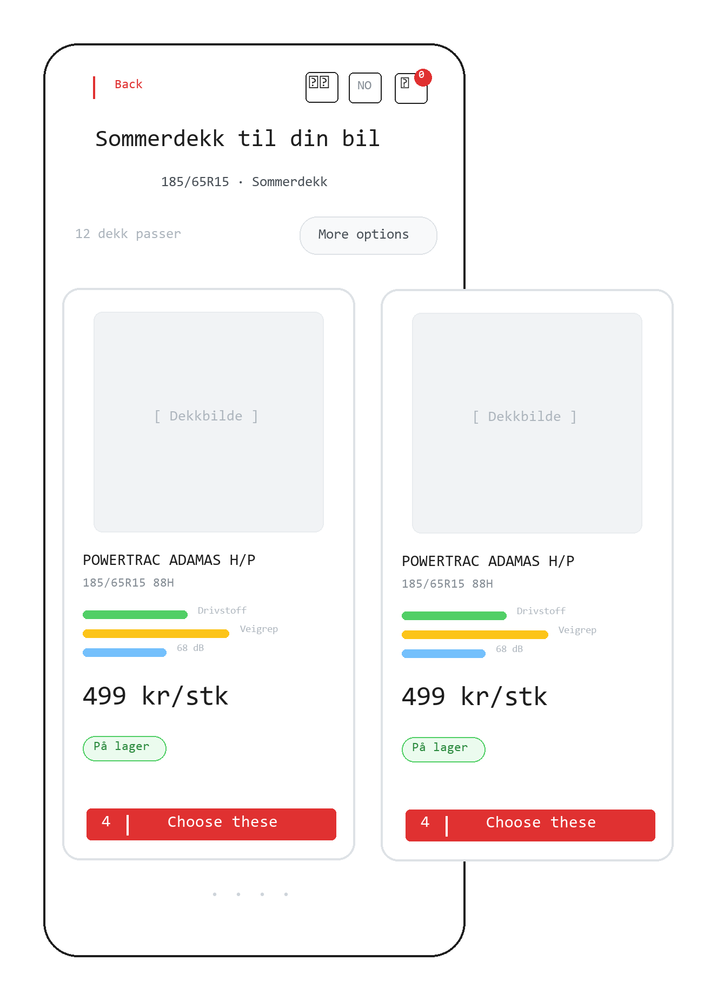

### 01.2-Product Cards

**Previous Step:** ← [01.1-Dimension Input](../01.1-dimension-input/01.1-dimension-input.md)
**Next Step:** → [01.3-Product Detail](../01.3-product-detail/01.3-product-detail.md)



**Previous Step:** ← [01.1-Dimension Input](../01.1-dimension-input/01.1-dimension-input.md)
**Next Step:** → [01.3-Product Detail](../01.3-product-detail/01.3-product-detail.md)

---

# 01.2-Product Cards

## Page Metadata

| Property | Value |
|----------|-------|
| **Scenario** | 01: Harriet's Tire Purchase |
| **Page Number** | 01.2 |
| **Platform** | Mobile web (responsive) |
| **Page Type** | Parallax Section (continuous surface) |
| **Viewport** | Mobile-first (< 768px) |
| **Interaction** | Touch-first |
| **Visibility** | Public |

---

## Overview

**Page Purpose:** Present matching tires as browsable cards so Harriet can compare options and pick one.

**User Situation:** Harriet just entered her tire dimension (205/55R16) and tapped "Finn dekk". The parallax surface transitions down to reveal product cards. She has 5 minutes between clients, phone in hand, and wants to quickly find an affordable tire.

**Success Criteria:** User identifies a tire that fits her needs and taps a card to see details.

**Entry Points:**
- Parallax transition from 01.1-Dimension Input after submitting a valid dimension
- Direct URL with dimension parameter (shared link, bookmark)

**Exit Points:**
- Taps a product card → 01.3-Product Detail (overlay/expand)
- Taps "Edit" on dimension bar → scrolls back to 01.1-Dimension Input
- Taps filter button → filter overlay opens (brand, season)

---

## Reference Materials

**Strategic Foundation:**
- [Product Brief](../../../A-Product-Brief/01-product-brief.md) - Vision, positioning, tone of voice
- [Trigger Map — Harriet](../../../B-Trigger-Map/02-Harriet-the-Hairdresser.md) - Primary persona driving forces

**Related Pages:**
- [01.1-Dimension Input](../01.1-dimension-input/01.1-dimension-input.md) — previous step
- [01.3-Product Detail](../01.3-product-detail/01.3-product-detail.md) — next step

**Design System:**
- [Design System](../../../D-Design-System/00-design-system.md) — spacing, typography, color tokens

---

## Layout Structure

Horizontal card carousel below a sticky dimension summary bar. Part of the continuous parallax surface — not a separate page load.

```
+----------------------------------+
| [SHARIF]    [NO] [TEL] [CART]   |  Global Header (sticky)
+----------------------------------+
| 205/55R16 Summer      [Endre]   |  Dimension Summary Bar (sticky)
+----------------------------------+
|                                  |
|  12 dekk funnet    [Filter ▼]   |  Results Header
|                                  |
|  +----------+ +----------+ +--  |
|  | [img]    | | [img]    | |    |
|  |          | |          | |    |  Horizontal Card
|  | Brand    | | Brand    | |    |  Carousel
|  | Model    | | Model    | |    |  (swipe left/right)
|  | 205/55R16| | 205/55R16| |    |
|  |          | |          | |    |
|  | [F][G][N]| | [F][G][N]| |    |  EU Label Mini-Sliders
|  |          | |          | |    |
|  | 849 kr   | | 949 kr   | |    |
|  | [stock]  | | [stock]  | |    |
|  +----------+ +----------+ +--  |
|                                  |
|  ● ○ ○ ○ ○ ○                    |  Scroll Indicator
|                                  |
+----------------------------------+
```

**Responsive Behavior:**
- **Mobile (< 768px):** Single card visible with partial peek of next card. Horizontal swipe. Dimension bar sticky below header.
- **Tablet (768px - 1024px):** Two cards visible side by side, swipeable. Wider card padding.
- **Desktop (>= 1024px):** Grid layout (3-4 cards per row), no swipe — standard scroll. Filter sidebar instead of collapsed overlay.

---

## Spacing

**Scale:** [Spacing Scale](../../../D-Design-System/00-design-system.md#spacing-scale)

| Property | Token |
|----------|-------|
| Page padding (horizontal) | space-md (mobile) / space-lg (desktop) |
| Section gap | space-xl |
| Element gap (default) | space-md |
| Component gap (within groups) | space-sm |
| Card internal padding | space-lg |
| Card gap (between cards) | space-sm |

---

## Typography

**Scale:** [Type Scale](../../../D-Design-System/00-design-system.md#type-scale)

| Element | Semantic | Size | Weight | Typeface |
|---------|----------|------|--------|----------|
| Dimension summary text | p | text-sm | medium | default |
| Edit link | a | text-sm | normal | default |
| Result count | p | text-sm | normal | default |
| Filter button label | span | text-sm | medium | default |
| Card brand + model | H3 | text-md | bold | display (condensed) |
| Card dimension | p | text-xs | normal | default |
| EU label labels | span | text-3xs | medium | default |
| Card price | p | text-lg | bold | display (condensed) |
| Price unit | span | text-xs | normal | default |
| Stock badge | span | text-xs | medium | default |

---

## Page Sections

### Section: Global Header

**OBJECT ID:** `cards-header`

| Property | Value |
|----------|-------|
| Purpose | Brand, navigation, language, cart — persists across all views |
| Padding | space-md space-lg |
| Element gap | space-md |
| Note | Identical to `dim-header` — shared global component |

---

### Section: Dimension Summary Bar

**OBJECT ID:** `cards-dim-bar`

| Property | Value |
|----------|-------|
| Purpose | Show current dimension selection, allow quick edit without scrolling back |
| Padding | space-sm space-md |
| Element gap | space-sm |
| Position | Sticky, below global header |
| Background | surface-muted |
| Border | border-subtle (bottom) |

---

#### Dimension Text

**OBJECT ID:** `cards-dim-bar-text`

| Property | Value |
|----------|-------|
| Component | [Body Text (medium weight)](../../../D-Design-System/00-design-system.md#text) |
| Translation Key | `dimBar.text` |
| NO | "{width}/{profile}R{rim} {season}" (e.g., "205/55R16 Sommer") |
| EN | "{width}/{profile}R{rim} {season}" (e.g., "205/55R16 Summer") |
| Note | Dynamically populated from submitted dimension |

#### Edit Link

**OBJECT ID:** `cards-dim-bar-edit`

| Property | Value |
|----------|-------|
| Component | [Text Link (brand-primary)](../../../D-Design-System/00-design-system.md#text-link) |
| Translation Key | `dimBar.edit` |
| NO | "Endre" |
| EN | "Edit" |
| Behavior | onClick → parallax scroll back to 01.1-Dimension Input |

---

### Section: Results Header

**OBJECT ID:** `cards-results-header`

| Property | Value |
|----------|-------|
| Purpose | Show result count and provide access to filters |
| Padding | space-md (horizontal), space-lg (top), space-sm (bottom) |
| Layout | Horizontal, space-between |

---

#### Result Count

**OBJECT ID:** `cards-results-count`

| Property | Value |
|----------|-------|
| Component | [Body Text](../../../D-Design-System/00-design-system.md#text) |
| Translation Key | `results.count` |
| NO | "{n} dekk funnet" |
| EN | "{n} tires found" |
| Note | Dynamic count from API response |

#### Filter Button

**OBJECT ID:** `cards-filter-btn`

| Property | Value |
|----------|-------|
| Component | [Button Secondary (compact)](../../../D-Design-System/00-design-system.md#secondary-button) |
| Translation Key | `results.filter` |
| NO | "Filter" |
| EN | "Filter" |
| Behavior | onClick → open filter overlay (brand, season checkboxes) |
| States | default, active (filters applied — show count badge) |
| Note | Harriet ignores this; Ole (mechanic persona) uses it |

---

### Section: Card Carousel

**OBJECT ID:** `cards-carousel`

| Property | Value |
|----------|-------|
| Purpose | Horizontally scrollable tire product cards, sorted by price (cheapest first) |
| Component | [Horizontal Scroll Container](../../../D-Design-System/00-design-system.md#horizontal-scroll-container) |
| Padding | space-md (horizontal — page-level, first card flush with content edge) |
| Scroll | Horizontal, snap to card, momentum scrolling |
| Overflow | visible (card peek) |

---

#### Product Card (Repeating)

**OBJECT ID:** `cards-card`

| Property | Value |
|----------|-------|
| Component | [Card (elevated, rounded)](../../../D-Design-System/00-design-system.md#card) |
| Purpose | Single tire product - all key info at a glance |
| Padding | space-lg |
| Element gap | space-sm |
| Background | surface-default |
| Border | border-default |
| Border radius | `radius-lg` |
| Shadow | `elevation-card` |
| Min width | `card-min-width-sm` |
| Behavior | onClick -> navigate to 01.3-Product Detail |

---

##### Card Image

**OBJECT ID:** `cards-card-image`

| Property | Value |
|----------|-------|
| Component | [Image (responsive, centered)](../../../D-Design-System/00-design-system.md#image) |
| Content | Tire product photo (square aspect, white background) |
| Fallback | Generic tire silhouette placeholder |
| Size | Full card width, aspect-ratio 1:1 |

##### ↕ `cards-v-space-sm` — compact gap between image and text content

##### Card Brand + Model

**OBJECT ID:** `cards-card-title`

| Property | Value |
|----------|-------|
| Component | [H3 Heading (condensed, bold)](../../../D-Design-System/00-design-system.md#h3-heading) |
| Translation Key | `card.title` |
| NO | "{brand} {model}" (e.g., "Continental PremiumContact 7") |
| EN | "{brand} {model}" |
| Note | Dynamic from product data. Truncate with ellipsis at 2 lines |

##### Card Dimension

**OBJECT ID:** `cards-card-dimension`

| Property | Value |
|----------|-------|
| Component | [Body Text (muted, small)](../../../D-Design-System/00-design-system.md#text) |
| Translation Key | `card.dimension` |
| NO | "{width}/{profile}R{rim} {loadIndex}{speedRating}" |
| EN | "{width}/{profile}R{rim} {loadIndex}{speedRating}" |
| Example | "205/55R16 91V" |

##### ↕ `cards-v-space-xs` — tight gap before EU label block

##### EU Label Mini-Sliders (Container)

**OBJECT ID:** `cards-card-eu`

| Property | Value |
|----------|-------|
| Component | [EU Label Compact](../../../D-Design-System/00-design-system.md#eu-label-compact) |
| Purpose | At-a-glance EU tire label ratings — fuel, grip, noise |
| Layout | Horizontal (3 equal columns) |
| Element gap | space-xs |

###### Fuel Efficiency Slider

**OBJECT ID:** `cards-card-eu-fuel`

| Property | Value |
|----------|-------|
| Component | [Mini Slider (green gradient)](../../../D-Design-System/00-design-system.md#mini-slider) |
| Translation Key | `euLabel.fuel` |
| NO | "Drivstoff" |
| EN | "Fuel" |
| Content | Letter grade (A-E) + visual bar fill |

###### Wet Grip Slider

**OBJECT ID:** `cards-card-eu-grip`

| Property | Value |
|----------|-------|
| Component | [Mini Slider (amber gradient)](../../../D-Design-System/00-design-system.md#mini-slider) |
| Translation Key | `euLabel.grip` |
| NO | "Veigrep" |
| EN | "Grip" |
| Content | Letter grade (A-E) + visual bar fill |

###### Noise Level Slider

**OBJECT ID:** `cards-card-eu-noise`

| Property | Value |
|----------|-------|
| Component | [Mini Slider (blue/info gradient)](../../../D-Design-System/00-design-system.md#mini-slider) |
| Translation Key | `euLabel.noise` |
| NO | "Støy" |
| EN | "Noise" |
| Content | dB value + wave icon (1-3 waves) |

##### ↕ `cards-v-space-sm` — breathing room before price

##### Card Price

**OBJECT ID:** `cards-card-price`

| Property | Value |
|----------|-------|
| Component | [Price Display (large, bold)](../../../D-Design-System/00-design-system.md#price-display) |
| Translation Key | `card.price` |
| NO | "{price} kr" |
| EN | "{price} kr" |
| Note | Per tire. Integer only, no decimals. Display font, condensed |

##### Price Unit Label

**OBJECT ID:** `cards-card-price-unit`

| Property | Value |
|----------|-------|
| Component | [Body Text (muted, small)](../../../D-Design-System/00-design-system.md#text) |
| Translation Key | `card.priceUnit` |
| NO | "per dekk" |
| EN | "per tire" |

##### ↕ `cards-v-space-xs` — tight gap before stock badge

##### Stock Badge

**OBJECT ID:** `cards-card-stock`

| Property | Value |
|----------|-------|
| Component | [Badge (status color)](../../../D-Design-System/00-design-system.md#badge) |
| Translation Key | `card.stock` |
| Variants | See table below |

| Variant | Color | NO | EN |
|---------|-------|----|----|
| In stock | success | "På lager" | "In stock" |
| Low stock | warning | "Få igjen" | "Low stock" |
| Out of stock | text-muted | "Ikke på lager" | "Out of stock" |

---

### Section: Scroll Indicator

**OBJECT ID:** `cards-scroll-indicator`

| Property | Value |
|----------|-------|
| Purpose | Show position in card list, hint that more cards exist |
| Component | [Dot Indicator](../../../D-Design-System/00-design-system.md#horizontal-scroll-container) |
| Layout | Horizontal, centered |
| Padding | space-md (top) |
| Behavior | Updates on scroll snap. Tappable to jump to card |

---

## Page States

| State | When | Appearance | Actions |
|-------|------|------------|---------|
| Loading | Transitioning from 01.1, API fetching | Skeleton cards (3 placeholders), dimension bar visible | Wait |
| Default | Products loaded | Cards populated, sorted cheapest first, first card in view | Swipe, tap card, tap filter, tap edit |
| Filtered | Filter applied | Card list updated, filter button shows active badge with count | Swipe, tap card, clear filter |
| Empty — No Results | Valid dimension but no products match | Illustration + "No tires found" message + suggestion to edit dimension | Tap edit, change filter |
| Error — API Failure | Network or server error | Error message with retry button | Tap retry, tap edit |

---

## Object Registry

| Object ID | Type | Description |
|-----------|------|-------------|
| `cards-header` | Section | Global header (shared) |
| `cards-dim-bar` | Section | Dimension summary bar (sticky) |
| `cards-dim-bar-text` | Body Text | Current dimension + season |
| `cards-dim-bar-edit` | Text Link | Edit dimension |
| `cards-results-header` | Section | Result count + filter access |
| `cards-results-count` | Body Text | "{n} dekk funnet" |
| `cards-filter-btn` | Button Secondary | Open filter overlay |
| `cards-carousel` | Scroll Container | Horizontal card carousel |
| `cards-card` | Card | Product card (repeating template) |
| `cards-card-image` | Image | Tire product photo |
| `cards-card-title` | H3 Heading | Brand + model name |
| `cards-card-dimension` | Body Text | Tire dimension string |
| `cards-card-eu` | EU Label Compact | Container for 3 mini-sliders |
| `cards-card-eu-fuel` | Mini Slider | Fuel efficiency grade |
| `cards-card-eu-grip` | Mini Slider | Wet grip grade |
| `cards-card-eu-noise` | Mini Slider | Noise level |
| `cards-card-price` | Price Display | Price per tire |
| `cards-card-price-unit` | Body Text | "per dekk" / "per tire" |
| `cards-card-stock` | Badge | Stock status |
| `cards-scroll-indicator` | Dot Indicator | Carousel position |
| `cards-v-space-sm` | Spacing | Compact gap (image to text, price area) |
| `cards-v-space-xs` | Spacing | Tight gap (EU labels, stock badge) |

---

## Technical Notes

- Part of the continuous parallax surface — no page load between 01.1 and 01.2
- Cards sorted by price ascending (cheapest first) by default
- Horizontal scroll uses CSS scroll-snap-type: x mandatory for card snapping
- Skeleton loading: 3 placeholder cards with shimmer animation during API fetch
- Card peek: ~20% of next card visible to hint horizontal scrolling
- Dimension bar is sticky (position: sticky) below the global header
- EU label mini-sliders are purely visual — no interaction, decorative ARIA role
- Product data fetched via API with dimension parameters; paginate if > 20 results
- Filter overlay (brand, season) is a separate component — not specified here
- Desktop breakpoint switches from carousel to grid layout (no horizontal scroll)

---

## Open Questions

| # | Question | Context | Status |
|---|----------|---------|--------|
| 1 | Card tap target - full card or dedicated button? | Full-card tap is now the chosen pattern; swipe remains available because the carousel still scrolls horizontally. | Resolved: full card tap target |
| 2 | Show "out of stock" tires in results or hide them? | Showing them proves selection breadth but frustrates if many are unavailable | Open |
| 3 | Pagination strategy - infinite scroll, "load more", or fixed set? | Affects performance and scroll indicator design | Open |
| 4 | Season detection - auto-select based on current date? | Summer tires in June, winter in November - reduces one filter step | Open |
| 5 | Price display - include/exclude VAT indicator? | Norwegian convention is VAT-included, but B2B users may expect ex-VAT | Open |

**Status Legend:** Open | In Discussion | Resolved

---

## Checklist

- [x] Page purpose clear
- [x] All Object IDs assigned
- [x] Components reference design system
- [x] Translations complete (NO/EN)
- [x] States documented
- [x] Conditional sections included where needed

---

**Previous Step:** ← [01.1-Dimension Input](../01.1-dimension-input/01.1-dimension-input.md)
**Next Step:** → [01.3-Product Detail](../01.3-product-detail/01.3-product-detail.md)

---

_Created using Whiteport Design Studio (WDS) methodology_
