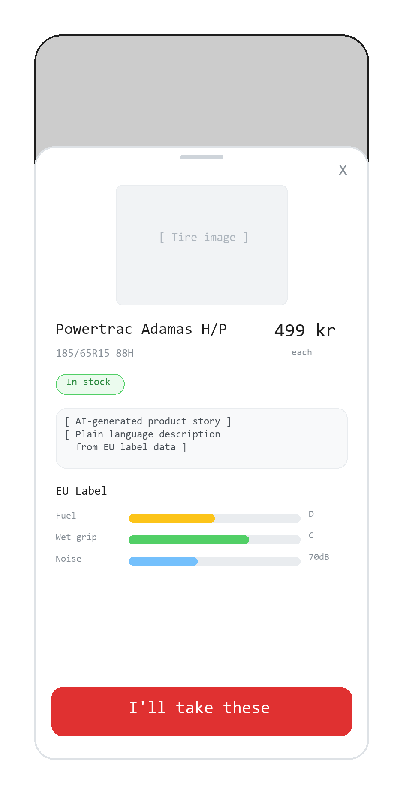

### 01.3-Product Detail

**Previous Step:** ← [01.2-Product Cards](../01.2-product-cards/01.2-product-cards.md)
**Next Step:** → [01.4-Quantity and Shop](../01.4-quantity-and-shop/01.4-quantity-and-shop.md)



**Previous Step:** ← [01.2-Product Cards](../01.2-product-cards/01.2-product-cards.md)
**Next Step:** → [01.4-Quantity and Shop](../01.4-quantity-and-shop/01.4-quantity-and-shop.md)

---

# 01.3-Product Detail

## Page Metadata

| Property | Value |
|----------|-------|
| **Scenario** | 01: Harriet's Tire Purchase |
| **Page Number** | 01.3 |
| **Platform** | Mobile web, responsive |
| **Page Type** | Drawer / Bottom Sheet |
| **Viewport** | Mobile-first |
| **Interaction** | Touch-first |
| **Visibility** | Public |

---

## Overview

**Page Purpose:** Let Harriet confirm that this tire is the right one. The AI product story translates EU label data into plain language she understands. The price and stock status stay prominent. If she's satisfied, she taps the CTA to proceed.

**User Situation:** Harriet tapped a product card from the card stack (01.2). She wants to understand what this tire actually means for her daily driving — not read a spec sheet. She needs confidence that the price is right, it's in stock, and it performs well enough.

**Success Criteria:**
- Harriet reads the AI story and feels informed without confusion
- She sees price, stock, and EU ratings at a glance
- She taps "Jeg tar disse" within 15 seconds of opening the overlay
- Or she closes the overlay and returns to browsing — no dead ends

**Entry Points:**
- Tap on a product card in the card stack (01.2-Product Cards)

**Exit Points:**
- Tap "Jeg tar disse" / "I'll take these" CTA → 01.4-Quantity and Shop
- Swipe down or tap close (X) → return to 01.2-Product Cards

---

## Reference Materials

**Strategic Foundation:**
- [Scenario: Harriet's Tire Purchase](../01-harriets-tire-purchase.md) — Full user scenario

**Related Pages:**
- [01.2-Product Cards](../01.2-product-cards/01.2-product-cards.md) — Previous step: card stack browse
- [01.4-Quantity and Shop](../01.4-quantity-and-shop/01.4-quantity-and-shop.md) — Next step: select quantity and pickup shop

**Design System:**
- [Design System](../../../D-Design-System/00-design-system.md) — Tokens, spacing, typography

---

## Layout Structure

Bottom sheet overlay that slides up from the bottom of the viewport. Uses `sheet-height-tall` on mobile so the product cards (01.2) remain visible behind a darkened/blurred scrim at the top.

```
+──────────────────────+
│ ░░░ scrim ░░░░░░░░░░ │  ← Blurred cards behind
├──────────────────────┤
│ ─── drag handle ───  │  ← Swipe down to close
│  [X]                 │  ← Close button, top-right
│                      │
│  ┌────────────────┐  │
│  │  Tire Image    │  │  ← Larger product image
│  └────────────────┘  │
│                      │
│  Brand + Model       │  ← e.g. "Powertrac Adamas H/P"
│  Dimension           │  ← e.g. "185/65R15 88H"
│  ┌──────┐ ┌───────┐  │
│  │Price │ │ Stock │  │  ← Price + stock badge
│  └──────┘ └───────┘  │
│                      │
│  ┌────────────────┐  │
│  │ AI Product     │  │  ← Plain-language story
│  │ Story          │  │
│  └────────────────┘  │
│                      │
│  ┌────────────────┐  │
│  │ EU Label       │  │
│  │ Fuel   ████░░  │  │  ← Slider + expandable
│  │ Grip   █████░  │  │  ← Slider + expandable
│  │ Noise  ███░░░  │  │  ← Slider + expandable
│  └────────────────┘  │
│                      │
├──────────────────────┤
│ [ Jeg tar disse    ] │  ← Sticky CTA, red, full width
+──────────────────────+
```

**Responsive behavior:**
- **Mobile (< 768px):** Full-width bottom sheet using `sheet-height-tall`; content scrolls vertically within the sheet
- **Tablet (768px-1024px):** Bottom sheet uses `content-max-lg`, centered horizontally
- **Desktop (>= 1024px):** Side panel or centered modal using `content-max-md` - the bottom sheet pattern is mobile-native; on desktop, consider a side drawer or centered overlay

---

## Spacing

**Scale:** [Spacing Scale](../../../D-Design-System/00-design-system.md#spacing-scale)

| Property | Token |
|----------|-------|
| Sheet padding (horizontal) | space-lg |
| Sheet padding (top, above drag handle) | space-sm |
| Section gap (between major sections) | space-xl |
| Element gap (default within sections) | space-md |
| Component gap (within tight groups) | space-sm |
| CTA bottom safe area | space-lg |

---

## Typography

**Scale:** [Type Scale](../../../D-Design-System/00-design-system.md#type-scale)

| Element | Semantic | Size | Weight | Typeface |
|---------|----------|------|--------|----------|
| Brand + Model | H2 | text-xl | bold | display |
| Dimension | p | text-md | normal | default |
| Price | p | text-2xl | bold | display |
| Stock badge | span | text-xs | semibold | default |
| AI story heading | H3 | text-sm | semibold | default |
| AI story body | p | text-md | normal | default |
| EU label heading | H3 | text-sm | semibold | default |
| EU slider label | p | text-sm | medium | default |
| EU slider rating | span | text-sm | bold | default |
| EU expanded explanation | p | text-sm | normal | default |
| CTA button | button | text-lg | bold | default |

---

## Page Sections

### Section: Overlay Chrome

**OBJECT ID:** `detail-chrome`

| Property | Value |
|----------|-------|
| Purpose | Provides overlay structure — drag handle, close button, scrim backdrop |
| Component | [Bottom Sheet / Drawer](../../../D-Design-System/00-design-system.md#bottom-sheet-drawer) |
| Padding | space-sm (top) space-lg (horizontal) |

---

#### Drag Handle

**OBJECT ID:** `detail-drag-handle`

| Property | Value |
|----------|-------|
| Component | [Drag Handle Bar](../../../D-Design-System/00-design-system.md#drag-handle-bar) |
| Behavior | Swipe down to dismiss overlay -> return to 01.2-Product Cards |
| Visual | Centered horizontal bar using `drag-handle-width-sm`, `drag-handle-height-xs`, `border-default`, and `radius-pill` |

---

#### Close Button

**OBJECT ID:** `detail-close-btn`

| Property | Value |
|----------|-------|
| Component | [Icon Button](../../../D-Design-System/00-design-system.md#icon-button) |
| Translation Key | `detail.close.aria` |
| NO | "Lukk" |
| EN | "Close" |
| Behavior | onClick → dismiss overlay, return to 01.2-Product Cards |
| Position | Top-right corner of overlay |

---

#### ↕ `detail-v-space-lg` — breathing room between chrome and product content

---

### Section: Product Identity

**OBJECT ID:** `detail-product-identity`

| Property | Value |
|----------|-------|
| Purpose | Hero area — tire image, brand/model, dimension, price, stock status |
| Padding | space-lg (horizontal, inherited from sheet) |
| Element gap | space-md |

---

#### Tire Image

**OBJECT ID:** `detail-tire-image`

| Property | Value |
|----------|-------|
| Component | [Image](../../../D-Design-System/00-design-system.md#image) |
| Purpose | Larger version of the product card image (NanoBanana generated) |
| Aspect ratio | 4:3 |
| Alt text key | `detail.image.alt` |
| NO | "{Brand} {Model} dekk" |
| EN | "{Brand} {Model} tire" |
| Loading | Skeleton placeholder until loaded |

---

#### ↕ `detail-v-space-sm` — tight gap between image and text identity

---

#### Brand and Model

**OBJECT ID:** `detail-brand-model`

| Property | Value |
|----------|-------|
| Component | [Text](../../../D-Design-System/00-design-system.md#text) |
| Semantic | H2 |
| Translation Key | `detail.brand_model` |
| NO | "{Brand} {Model}" (e.g., "Powertrac Adamas H/P") |
| EN | "{Brand} {Model}" (e.g., "Powertrac Adamas H/P") |

---

#### Dimension

**OBJECT ID:** `detail-dimension`

| Property | Value |
|----------|-------|
| Component | [Text](../../../D-Design-System/00-design-system.md#text) |
| Translation Key | `detail.dimension` |
| NO | "{Dimension}" (e.g., "185/65R15 88H") |
| EN | "{Dimension}" (e.g., "185/65R15 88H") |

---

#### ↕ `detail-v-space-sm` — tight gap before price row

---

#### Price and Stock Row (Container)

**OBJECT ID:** `detail-price-stock-row`

| Property | Value |
|----------|-------|
| Component | [Flex Row](../../../D-Design-System/00-design-system.md#flex-row) |
| Purpose | Groups price and stock badge on same line |
| Layout | Horizontal, space-between, align-center |

##### Price

**OBJECT ID:** `detail-price`

| Property | Value |
|----------|-------|
| Component | [Text](../../../D-Design-System/00-design-system.md#text) |
| Translation Key | `detail.price` |
| NO | "{Price} kr/stk" (e.g., "499 kr/stk") |
| EN | "{Price} NOK/ea" (e.g., "499 NOK/ea") |

##### Stock Badge

**OBJECT ID:** `detail-stock-badge`

| Property | Value |
|----------|-------|
| Component | [Badge](../../../D-Design-System/00-design-system.md#badge) |
| Translation Key | `detail.stock` |
| NO | "På lager" / "Få igjen" / "Ikke på lager" |
| EN | "In stock" / "Few left" / "Out of stock" |
| Color | success (in stock) / warning (few left) / brand-gray (out of stock) |

---

#### ↕ `detail-v-space-xl` — major section boundary before AI story

---

### Section: AI Product Story

**OBJECT ID:** `detail-ai-story`

| Property | Value |
|----------|-------|
| Purpose | Plain-language tire description generated from EU label data. The hero content - this is what Harriet actually reads. |
| Padding | space-lg (horizontal, inherited) |
| Element gap | space-sm |
| Background | surface-muted |
| Border radius | `radius-md` |
| Inner padding | space-lg |

---

#### Story Heading

**OBJECT ID:** `detail-ai-story-heading`

| Property | Value |
|----------|-------|
| Component | [Text](../../../D-Design-System/00-design-system.md#text) |
| Semantic | H3 |
| Translation Key | `detail.story.heading` |
| NO | "Kort fortalt" |
| EN | "In short" |

---

#### Story Body

**OBJECT ID:** `detail-ai-story-body`

| Property | Value |
|----------|-------|
| Component | [Text](../../../D-Design-System/00-design-system.md#text) |
| Translation Key | `detail.story.body` |
| NO | (AI-generated) e.g., "Et solid hverdagsdekk som ikke tapper lommeboken eller tanken. Bra grep i regnet, normalt støynivå, og holder lenge nok til at du glemmer at du har det. Perfekt for kjøring til jobb og butikk." |
| EN | (AI-generated) e.g., "A solid everyday tire that won't drain your wallet or your fuel tank. Good grip in the rain, normal noise level, and lasts long enough that you forget you have it. Perfect for driving to work and the shop." |
| Tone | Warm, unfussy, like a friend explaining. Not a data sheet. |

---

#### ↕ `detail-v-space-xl` — major section boundary before EU label

---

### Section: EU Label Sliders

**OBJECT ID:** `detail-eu-label`

| Property | Value |
|----------|-------|
| Purpose | Three EU label metrics as visual sliders. Each is tappable to expand a plain-language explanation. |
| Padding | space-lg (horizontal, inherited) |
| Element gap | space-md (between individual slider rows) |

---

#### EU Label Heading

**OBJECT ID:** `detail-eu-label-heading`

| Property | Value |
|----------|-------|
| Component | [Text](../../../D-Design-System/00-design-system.md#text) |
| Semantic | H3 |
| Translation Key | `detail.eu_label.heading` |
| NO | "EU-merking" |
| EN | "EU label" |

---

#### ↕ `detail-v-space-sm` — between heading and first slider

---

#### Fuel Slider

**OBJECT ID:** `detail-eu-fuel`

| Property | Value |
|----------|-------|
| Component | [EU Label Slider (expandable)](../../../D-Design-System/00-design-system.md#eu-label-slider) |
| Translation Key (label) | `detail.eu_label.fuel.label` |
| NO (label) | "Drivstoff" |
| EN (label) | "Fuel" |
| Value | Dynamic rating (A–G) |
| Behavior | onTap → expand explanation below |

##### Fuel Explanation (Expanded)

**OBJECT ID:** `detail-eu-fuel-explanation`

| Property | Value |
|----------|-------|
| Component | [Text (collapsible)](../../../D-Design-System/00-design-system.md#text) |
| Translation Key | `detail.eu_label.fuel.explanation` |
| NO | "Gjennomsnittlig drivstofforbruk — du merker ingen forskjell på bensinkostnaden." |
| EN | "Average fuel consumption — you won't notice a difference on your fuel bill." |
| Default state | Collapsed |

---

#### Grip Slider

**OBJECT ID:** `detail-eu-grip`

| Property | Value |
|----------|-------|
| Component | [EU Label Slider (expandable)](../../../D-Design-System/00-design-system.md#eu-label-slider) |
| Translation Key (label) | `detail.eu_label.grip.label` |
| NO (label) | "Veigrep" |
| EN (label) | "Grip" |
| Value | Dynamic rating (A–G) |
| Behavior | onTap → expand explanation below |

##### Grip Explanation (Expanded)

**OBJECT ID:** `detail-eu-grip-explanation`

| Property | Value |
|----------|-------|
| Component | [Text (collapsible)](../../../D-Design-System/00-design-system.md#text) |
| Translation Key | `detail.eu_label.grip.explanation` |
| NO | "Godt grep i regnet — bremser trygt i vate forhold." |
| EN | "Good grip in rain — brakes safely in wet conditions." |
| Default state | Collapsed |

---

#### Noise Slider

**OBJECT ID:** `detail-eu-noise`

| Property | Value |
|----------|-------|
| Component | [EU Label Slider (expandable)](../../../D-Design-System/00-design-system.md#eu-label-slider) |
| Translation Key (label) | `detail.eu_label.noise.label` |
| NO (label) | "Støy" |
| EN (label) | "Noise" |
| Value | Dynamic dB value + class (A/B/C) |
| Behavior | onTap → expand explanation below |

##### Noise Explanation (Expanded)

**OBJECT ID:** `detail-eu-noise-explanation`

| Property | Value |
|----------|-------|
| Component | [Text (collapsible)](../../../D-Design-System/00-design-system.md#text) |
| Translation Key | `detail.eu_label.noise.explanation` |
| NO | "Normalt dekk-støynivå. Du hører musikken din fint." |
| EN | "Normal tire noise. You can hear your music fine." |
| Default state | Collapsed |

---

#### ↕ `detail-v-space-2xl` — space before sticky CTA area (content must not be hidden behind it)

---

### Section: Sticky CTA

**OBJECT ID:** `detail-cta-section`

| Property | Value |
|----------|-------|
| Purpose | Primary action — confirms tire selection and proceeds to quantity/shop |
| Position | Sticky bottom of overlay |
| Background | surface-default with top border (border-subtle) |
| Padding | space-lg (horizontal) space-md (vertical) |
| Safe area | space-lg bottom (for mobile home indicator) |

---

#### CTA Button

**OBJECT ID:** `detail-cta-btn`

| Property | Value |
|----------|-------|
| Component | [Button (Primary)](../../../D-Design-System/00-design-system.md#primary-button) |
| Translation Key | `detail.cta` |
| NO | "Jeg tar disse" |
| EN | "I'll take these" |
| Color | brand-primary background, text-inverse text |
| Width | Full width |
| Behavior | onClick → transition to 01.4-Quantity and Shop |
| Disabled state | When stock = "Ikke på lager" / "Out of stock" |

---

## Page States

| State | When | Appearance | Actions |
|-------|------|------------|---------|
| Default | Overlay opens with product data loaded | Full content visible, CTA active | Scroll, expand EU labels, tap CTA, close |
| Loading | Product data still fetching | Skeleton placeholders for image, text, sliders | Close overlay only |
| In Stock | Stock > threshold | Green "På lager" badge, CTA enabled | All actions available |
| Low Stock | Stock below threshold | Amber "Få igjen" badge, CTA enabled | All actions available |
| Out of Stock | Stock = 0 | Gray "Ikke på lager" badge, CTA disabled (grayed out) | Close overlay, browse other tires |
| EU Expanded | User tapped a slider | Explanation text slides open below the slider | Tap again to collapse, tap other sliders |
| Error | API failure loading product data | Error message with retry option | Retry or close overlay |

---

## Object Registry

| Object ID | Type | Section | Translation Key |
|-----------|------|---------|-----------------|
| `detail-chrome` | Section | Overlay Chrome | — |
| `detail-drag-handle` | Interactive | Overlay Chrome | — |
| `detail-close-btn` | Interactive | Overlay Chrome | `detail.close.aria` |
| `detail-product-identity` | Section | Product Identity | — |
| `detail-tire-image` | Visual | Product Identity | `detail.image.alt` |
| `detail-brand-model` | Text | Product Identity | `detail.brand_model` |
| `detail-dimension` | Text | Product Identity | `detail.dimension` |
| `detail-price-stock-row` | Container | Product Identity | — |
| `detail-price` | Text | Product Identity | `detail.price` |
| `detail-stock-badge` | Badge | Product Identity | `detail.stock` |
| `detail-ai-story` | Section | AI Product Story | — |
| `detail-ai-story-heading` | Text | AI Product Story | `detail.story.heading` |
| `detail-ai-story-body` | Text | AI Product Story | `detail.story.body` |
| `detail-eu-label` | Section | EU Label Sliders | — |
| `detail-eu-label-heading` | Text | EU Label Sliders | `detail.eu_label.heading` |
| `detail-eu-fuel` | Interactive | EU Label Sliders | `detail.eu_label.fuel.label` |
| `detail-eu-fuel-explanation` | Text | EU Label Sliders | `detail.eu_label.fuel.explanation` |
| `detail-eu-grip` | Interactive | EU Label Sliders | `detail.eu_label.grip.label` |
| `detail-eu-grip-explanation` | Text | EU Label Sliders | `detail.eu_label.grip.explanation` |
| `detail-eu-noise` | Interactive | EU Label Sliders | `detail.eu_label.noise.label` |
| `detail-eu-noise-explanation` | Text | EU Label Sliders | `detail.eu_label.noise.explanation` |
| `detail-cta-section` | Section | Sticky CTA | — |
| `detail-cta-btn` | Interactive | Sticky CTA | `detail.cta` |

---

## Technical Notes

- **Bottom sheet behavior:** Use a spring-based animation for open/close. Overlay slides up from bottom with velocity-based dismiss (fast swipe down = close, slow drag = snap back or close depending on a mid-sheet dismiss threshold).
- **Scrim backdrop:** Cards behind the overlay get `blur-sm` plus `scrim-soft`. Tapping the scrim closes the overlay.
- **Scroll containment:** Content scrolls within the overlay. The page behind must not scroll (scroll lock on body while overlay is open).
- **Sticky CTA:** The CTA button is positioned sticky at the bottom of the overlay viewport, not the scrollable content. It must account for the mobile safe area (home indicator).
- **AI story generation:** The product story is generated server-side from EU label data and cached per product. It is not generated on-the-fly in the client.
- **EU slider animations:** Sliders render as colored bars proportional to the rating (A=full, G=minimal). Expand/collapse uses a height transition (200ms ease-out).
- **Accessibility:** Overlay must trap focus while open. Close button and CTA are the first and last focusable elements. ESC key dismisses. `role="dialog"` with `aria-modal="true"`. EU sliders use `<details>`/`<summary>` or equivalent ARIA disclosure pattern.
- **Performance:** Product data should be prefetched or cached from the card view. Opening the overlay should feel instant — no loading spinner for the common case.

---

## Open Questions

| # | Question | Context | Status |
|---|----------|---------|--------|
| 1 | Should the AI story adapt per EU label rating, or is one story generated per product regardless of rating changes? | Story tone depends on whether ratings are static per product or could vary | 🟢 Resolved: One story per product, generated from static EU label data |
| 2 | What happens when the user has no-motion preferences enabled? | Bottom sheet slide-up animation may need reduced-motion alternative | 🔴 Open |
| 3 | Should multiple EU sliders be expandable simultaneously, or accordion-style (one at a time)? | Affects vertical space and scrolling behavior | 🔴 Open |
| 4 | Desktop layout: side drawer or centered modal? | Bottom sheet is mobile-native; desktop needs a different container | 🔴 Open |

**Status Legend:** 🔴 Open | 🟡 In Discussion | 🟢 Resolved

---

## Checklist

- [x] Page purpose clear
- [x] All Object IDs assigned (prefix: `detail-`)
- [x] Components reference design system
- [x] Translations complete (NO/EN)
- [x] States documented
- [x] Spacing uses design system tokens
- [x] Typography uses design system tokens
- [x] Entry and exit points defined
- [x] Accessibility notes included
- [ ] Sketch updated to match spec
- [ ] Design system components extracted (EU Label Slider, Bottom Sheet)

---

**Previous Step:** ← [01.2-Product Cards](../01.2-product-cards/01.2-product-cards.md)
**Next Step:** → [01.4-Quantity and Shop](../01.4-quantity-and-shop/01.4-quantity-and-shop.md)

---

_Created using Whiteport Design Studio (WDS) methodology_
