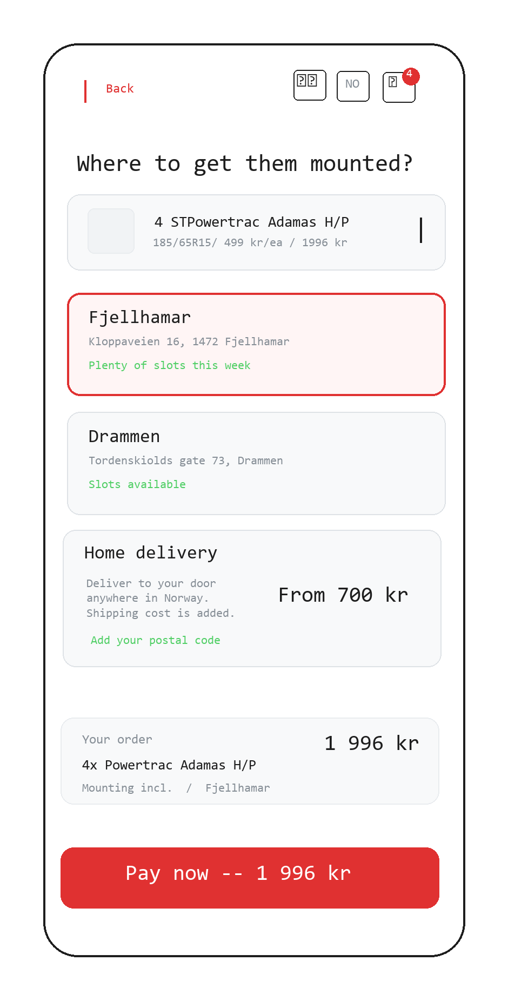

### 01.4-Delivery and Mounting

**Previous Step:** ← [01.2-Product Cards](../01.2-product-cards/01.2-product-cards.md)
**Next Step:** → [01.5-Payment](../01.5-payment/01.5-payment.md)



**Previous Step:** ← [01.2-Product Cards](../01.2-product-cards/01.2-product-cards.md)
**Next Step:** → [01.5-Payment](../01.5-payment/01.5-payment.md)

---

# 01.4-Delivery and Mounting

## Page Metadata

| Property | Value |
|----------|-------|
| **Scenario** | 01: Harriet's Tire Purchase |
| **Page Number** | 01.4 |
| **Platform** | Mobile web, responsive |
| **Page Type** | Full Page (parallax surface continuation) |
| **Viewport** | Mobile-first |
| **Interaction** | Touch-first |
| **Visibility** | Public |

---

## Overview

**Page Purpose:** Let Harriet pick where to get her tires mounted. Quantity was already chosen on the product card — one decision left, then she pays.

**User Situation:** Harriet tapped "Velg disse" on a product card in 01.2. Her tire is already in the cart with the quantity she selected (default 4). This view slides up to confirm the order and let her pick a mounting location. She has committed to the tire and quantity — just one choice remains.

**Success Criteria:**
- She picks a mounting shop within 5 seconds — two clear options, no decision paralysis
- The total on the CTA button gives her confidence — no hidden costs
- She taps "Betal nå" within 10 seconds of arriving on this view

**Entry Points:**
- Tap "Velg disse" on 01.2-Product Cards (adds to cart, opens this view)

**Exit Points:**
- Tap "Betal nå — 1 996 kr" / "Pay now — 1 996 kr" CTA → 01.5-Payment
- Tap back / browser back → return to 01.2-Product Cards (in-cart state)

---

## Reference Materials

**Strategic Foundation:**
- [Scenario: Harriet's Tire Purchase](../01-harriets-tire-purchase.md) — Full user scenario

**Related Pages:**
- [01.2-Product Cards](../01.2-product-cards/01.2-product-cards.md) — Previous step: select tire and quantity
- [01.5-Payment](../01.5-payment/01.5-payment.md) — Next step: Klarna/Qliro checkout

**Design System:**
- [Design System](../../../D-Design-System/00-design-system.md) — Tokens, spacing, typography

---

## Layout Structure

Continuous parallax surface — this view slides up over the results. The selected product is shown in a compact summary at top (with quantity carried from the card picker). Below: shop selector, order summary, sticky CTA.

```
+──────────────────────────+
│  ┌────────────────────┐  │
│  │ [img] Powertrac    │  │  ← Compact product summary
│  │       Adamas H/P   │  │    (quantity + unit price shown)
│  │  4 stk · 499 kr/stk│  │
│  │  [Endre antall]    │  │  ← Fallback: small link to change qty
│  └────────────────────┘  │
│                          │
│  Hvor vil du montere?    │  ← Shop heading
│  ┌────────────────────┐  │
│  │ ● Fjellhamar       │  │  ← Shop card (selected)
│  │   Kloppaveien 16   │  │
│  │   ✓ Mange ledige   │  │
│  │     tider denne    │  │
│  │     uken           │  │
│  └────────────────────┘  │
│  ┌────────────────────┐  │
│  │   Drammen          │  │  ← Shop card
│  │   Tordenskiolds    │  │
│  │   gate 73          │  │
│  │   ✓ Mange ledige   │  │
│  │     tider denne    │  │
│  │     uken           │  │
│  └────────────────────┘  │
│                          │
│  ┌────────────────────┐  │
│  │ 4 × 499 kr         │  │  ← Order summary
│  │ Totalt: 1 996 kr   │  │
│  │ Montering:         │  │
│  │   Fjellhamar       │  │
│  └────────────────────┘  │
│                          │
├──────────────────────────┤
│ [ Betal nå — 1 996 kr  ] │  ← Sticky CTA, red, full width
+──────────────────────────+
```

**Responsive behavior:**
- **Mobile (< 768px):** Full-width single column. Shop cards stacked. Sticky CTA at bottom.
- **Tablet (768px-1024px):** Uses `content-max-lg`, centered. Shop cards may sit side by side if space allows.
- **Desktop (>= 1024px):** Uses `content-max-md`, centered, or placed alongside a persistent product image on the left. CTA remains prominent at bottom of content area.

---

## Spacing

**Scale:** [Spacing Scale](../../../D-Design-System/00-design-system.md#spacing-scale)

| Property | Token |
|----------|-------|
| Page padding (horizontal) | space-lg |
| Section gap (between major sections) | space-xl |
| Element gap (default within sections) | space-md |
| Component gap (within tight groups) | space-sm |
| CTA bottom safe area | space-lg |

---

## Typography

**Scale:** [Type Scale](../../../D-Design-System/00-design-system.md#type-scale)

| Element | Semantic | Size | Weight | Typeface |
|---------|----------|------|--------|----------|
| Product name (summary) | p | text-md | semibold | default |
| Quantity + unit price (summary) | p | text-sm | normal | default |
| Fallback edit link ("Endre antall") | a | text-xs | normal | default |
| Section heading ("Hvor vil du montere?") | H2 | text-xl | bold | display |
| Shop card name | H3 | text-lg | semibold | default |
| Shop card address | p | text-sm | normal | default |
| Availability hint | p | text-xs | medium | default |
| Order summary label | p | text-sm | normal | default |
| Order summary total | p | text-xl | bold | display |
| Order summary location | p | text-sm | normal | default |
| CTA button | button | text-lg | bold | default |

---

## Page Sections

### Section: Product Summary

**OBJECT ID:** `dm-product-summary`

| Property | Value |
|----------|-------|
| Purpose | Compact confirmation of the selected tire - decision is made, moving forward |
| Background | surface-muted |
| Border radius | `radius-md` |
| Padding | space-md |
| Layout | Horizontal - thumbnail left, text right |

---

#### Product Thumbnail

**OBJECT ID:** `dm-product-thumb`

| Property | Value |
|----------|-------|
| Component | [Image](../../../D-Design-System/00-design-system.md#image) |
| Purpose | Small tire image from 01.3, reinforcing visual continuity |
| Size | `thumb-size-md` x `thumb-size-md` |
| Border radius | `radius-sm` |
| Alt text key | `dm.product.image.alt` |
| NO | "{Brand} {Model} dekk" |
| EN | "{Brand} {Model} tire" |

---

#### Product Name

**OBJECT ID:** `dm-product-name`

| Property | Value |
|----------|-------|
| Component | [Text](../../../D-Design-System/00-design-system.md#text) |
| Translation Key | `dm.product.name` |
| NO | "{Brand} {Model}" (e.g., "Powertrac Adamas H/P") |
| EN | "{Brand} {Model}" (e.g., "Powertrac Adamas H/P") |

---

#### Product Quantity Line

**OBJECT ID:** `dm-product-qty`

| Property | Value |
|----------|-------|
| Component | [Text](../../../D-Design-System/00-design-system.md#text) |
| Translation Key | `dm.product.qty_line` |
| NO | "{Qty} stk · {Price} kr/stk" (e.g., "4 stk · 499 kr/stk") |
| EN | "{Qty} pcs · {Price} NOK/ea" (e.g., "4 pcs · 499 NOK/ea") |
| Content | Quantity is carried from 01.2 card picker — not editable here |

---

#### Fallback: Edit Quantity Link

**OBJECT ID:** `dm-product-qty-edit`

| Property | Value |
|----------|-------|
| Component | [Text](../../../D-Design-System/00-design-system.md#text) |
| Purpose | Escape hatch — lets user go back and change quantity if needed |
| Translation Key | `dm.product.qty_edit` |
| NO | "Endre antall" |
| EN | "Change quantity" |
| Color | text-muted |
| Font size | text-xs |
| Behavior | onClick → navigate back to 01.2-Product Cards (browser back) |

---

#### ↕ `dm-v-space-xl` — section boundary between product summary and shop selector

---

### Section: Shop Selector

**OBJECT ID:** `dm-shop-section`

| Property | Value |
|----------|-------|
| Purpose | Let Harriet pick where to get tires mounted. Two shops, simple cards. |
| Element gap | space-md |

---

#### Shop Heading

**OBJECT ID:** `dm-shop-heading`

| Property | Value |
|----------|-------|
| Component | [Text](../../../D-Design-System/00-design-system.md#text) |
| Semantic | H2 |
| Translation Key | `dm.shop.heading` |
| NO | "Hvor vil du montere?" |
| EN | "Where do you want mounting?" |

---

#### ↕ `dm-v-space-sm` — tight gap between heading and shop cards

---

#### Shop Card: Fjellhamar

**OBJECT ID:** `dm-shop-fjellhamar`

| Property | Value |
|----------|-------|
| Component | [Selectable Card](../../../D-Design-System/00-design-system.md#selectable-card) |
| Purpose | Fjellhamar mounting location |
| Behavior | onTap -> select this shop, deselect other, update order summary |
| Default state | Selected |
| Border | `border-width-strong` + brand-primary when selected, border-default when unselected |
| Border radius | `radius-md` |
| Padding | space-lg |
| Min height | `touch-target-lg` |

##### Shop Name: Fjellhamar

**OBJECT ID:** `dm-shop-fjellhamar-name`

| Property | Value |
|----------|-------|
| Component | [Text](../../../D-Design-System/00-design-system.md#text) |
| Translation Key | `dm.shop.fjellhamar.name` |
| NO | "Fjellhamar" |
| EN | "Fjellhamar" |

##### Shop Address: Fjellhamar

**OBJECT ID:** `dm-shop-fjellhamar-address`

| Property | Value |
|----------|-------|
| Component | [Text](../../../D-Design-System/00-design-system.md#text) |
| Translation Key | `dm.shop.fjellhamar.address` |
| NO | "Kloppaveien 16, 1472 Fjellhamar" |
| EN | "Kloppaveien 16, 1472 Fjellhamar" |

##### Availability Hint: Fjellhamar

**OBJECT ID:** `dm-shop-fjellhamar-availability`

| Property | Value |
|----------|-------|
| Component | [Text](../../../D-Design-System/00-design-system.md#text) |
| Translation Key | `dm.shop.fjellhamar.availability` |
| NO | "Mange ledige tider denne uken" |
| EN | "Plenty of slots this week" |
| Color | success |
| Icon | Checkmark (inline, before text) |

---

#### ↕ `dm-v-space-sm` — tight gap between shop cards

---

#### Shop Card: Drammen

**OBJECT ID:** `dm-shop-drammen`

| Property | Value |
|----------|-------|
| Component | [Selectable Card](../../../D-Design-System/00-design-system.md#selectable-card) |
| Purpose | Drammen mounting location |
| Behavior | onTap -> select this shop, deselect other, update order summary |
| Default state | Unselected |
| Border | `border-width-strong` + brand-primary when selected, border-default when unselected |
| Border radius | `radius-md` |
| Padding | space-lg |
| Min height | `touch-target-lg` |

##### Shop Name: Drammen

**OBJECT ID:** `dm-shop-drammen-name`

| Property | Value |
|----------|-------|
| Component | [Text](../../../D-Design-System/00-design-system.md#text) |
| Translation Key | `dm.shop.drammen.name` |
| NO | "Drammen" |
| EN | "Drammen" |

##### Shop Address: Drammen

**OBJECT ID:** `dm-shop-drammen-address`

| Property | Value |
|----------|-------|
| Component | [Text](../../../D-Design-System/00-design-system.md#text) |
| Translation Key | `dm.shop.drammen.address` |
| NO | "Tordenskiolds gate 73, 3044 Drammen" |
| EN | "Tordenskiolds gate 73, 3044 Drammen" |

##### Availability Hint: Drammen

**OBJECT ID:** `dm-shop-drammen-availability`

| Property | Value |
|----------|-------|
| Component | [Text](../../../D-Design-System/00-design-system.md#text) |
| Translation Key | `dm.shop.drammen.availability` |
| NO | "Mange ledige tider denne uken" |
| EN | "Plenty of slots this week" |
| Color | success |
| Icon | Checkmark (inline, before text) |

---

#### ↕ `dm-v-space-xl` — major section boundary between shop selector and order summary

---

### Section: Order Summary

**OBJECT ID:** `dm-order-summary`

| Property | Value |
|----------|-------|
| Purpose | Confirms the full order before payment - no surprises |
| Background | surface-muted |
| Border radius | `radius-md` |
| Padding | space-lg |
| Element gap | space-sm |

---

#### Summary Line Items

**OBJECT ID:** `dm-summary-line`

| Property | Value |
|----------|-------|
| Component | [Text](../../../D-Design-System/00-design-system.md#text) |
| Translation Key | `dm.summary.line` |
| NO | "{Quantity} x {Price} kr" (e.g., "4 x 499 kr") |
| EN | "{Quantity} x {Price} NOK" (e.g., "4 x 499 NOK") |
| Behavior | Updates live when quantity changes |

---

#### Summary Total

**OBJECT ID:** `dm-summary-total`

| Property | Value |
|----------|-------|
| Component | [Text](../../../D-Design-System/00-design-system.md#text) |
| Translation Key | `dm.summary.total` |
| NO | "Totalt: {Total} kr" (e.g., "Totalt: 1 996 kr") |
| EN | "Total: {Total} NOK" (e.g., "Total: 1,996 NOK") |
| Behavior | Updates live when quantity changes |

---

#### Summary Mounting Location

**OBJECT ID:** `dm-summary-location`

| Property | Value |
|----------|-------|
| Component | [Text](../../../D-Design-System/00-design-system.md#text) |
| Translation Key | `dm.summary.location` |
| NO | "Montering: {Shop}" (e.g., "Montering: Fjellhamar") |
| EN | "Mounting: {Shop}" (e.g., "Mounting: Fjellhamar") |
| Behavior | Updates live when shop selection changes |

---

#### ↕ `dm-v-space-2xl` — space before sticky CTA area (content must not be hidden behind it)

---

### Section: Sticky CTA

**OBJECT ID:** `dm-cta-section`

| Property | Value |
|----------|-------|
| Purpose | Primary action — proceeds to payment with live total |
| Position | Sticky bottom of viewport |
| Background | surface-default with top border (border-subtle) |
| Padding | space-lg (horizontal) space-md (vertical) |
| Safe area | space-lg bottom (for mobile home indicator) |

---

#### CTA Button

**OBJECT ID:** `dm-cta-btn`

| Property | Value |
|----------|-------|
| Component | [Button (Primary)](../../../D-Design-System/00-design-system.md#primary-button) |
| Translation Key | `dm.cta` |
| NO | "Betal nå - {Total} kr" (e.g., "Betal nå - 1 996 kr") |
| EN | "Pay now - {Total} NOK" (e.g., "Pay now - 1,996 NOK") |
| Color | brand-primary background, text-inverse text |
| Width | Full width |
| Min height | `touch-target-md` |
| Behavior | onClick → navigate to 01.5-Payment. Total updates live when quantity changes. |
| Disabled state | Never — quantity defaults to 4, shop defaults to Fjellhamar. Always actionable. |

---

## Page States

| State | When | Appearance | Actions |
|-------|------|------------|---------|
| Default | Page loads with product + quantity carried from 01.2 | Product summary shows qty + unit price, shop = Fjellhamar, total shown in CTA | Select shop, tap CTA |
| Shop: Fjellhamar | Default or user taps Fjellhamar card | Fjellhamar card has brand-primary border, Drammen card has default border | Select Drammen, tap CTA |
| Shop: Drammen | User taps Drammen card | Drammen card has brand-primary border, Fjellhamar card has default border | Select Fjellhamar, tap CTA |
| Loading | Product data not yet available (edge case — normally carried from 01.2) | Skeleton placeholders for product summary, shop cards visible | Wait for data |
| Error | Product data failed to load | Error message with retry, CTA disabled | Retry or navigate back |

---

## Object Registry

| Object ID | Type | Section | Translation Key |
|-----------|------|---------|-----------------|
| `dm-product-summary` | Section | Product Summary | — |
| `dm-product-thumb` | Visual | Product Summary | `dm.product.image.alt` |
| `dm-product-name` | Text | Product Summary | `dm.product.name` |
| `dm-product-qty` | Text | Product Summary | `dm.product.qty_line` |
| `dm-product-qty-edit` | Interactive | Product Summary | `dm.product.qty_edit` |
| `dm-shop-section` | Section | Shop Selector | — |
| `dm-shop-heading` | Text | Shop Selector | `dm.shop.heading` |
| `dm-shop-fjellhamar` | Interactive | Shop Selector | — |
| `dm-shop-fjellhamar-name` | Text | Shop Selector | `dm.shop.fjellhamar.name` |
| `dm-shop-fjellhamar-address` | Text | Shop Selector | `dm.shop.fjellhamar.address` |
| `dm-shop-fjellhamar-availability` | Text | Shop Selector | `dm.shop.fjellhamar.availability` |
| `dm-shop-drammen` | Interactive | Shop Selector | — |
| `dm-shop-drammen-name` | Text | Shop Selector | `dm.shop.drammen.name` |
| `dm-shop-drammen-address` | Text | Shop Selector | `dm.shop.drammen.address` |
| `dm-shop-drammen-availability` | Text | Shop Selector | `dm.shop.drammen.availability` |
| `dm-order-summary` | Section | Order Summary | — |
| `dm-summary-line` | Text | Order Summary | `dm.summary.line` |
| `dm-summary-total` | Text | Order Summary | `dm.summary.total` |
| `dm-summary-location` | Text | Order Summary | `dm.summary.location` |
| `dm-cta-section` | Section | Sticky CTA | — |
| `dm-cta-btn` | Interactive | Sticky CTA | `dm.cta` |

---

## Technical Notes

- **Parallax continuity:** This view slides up over the results panel. No hard page break — the transition should feel like a natural continuation of the flow.
- **State carried from 01.2:** Product data (name, image, price, dimension) and quantity are passed from the card picker. This can be URL params, session state, or a shared store. No separate API fetch needed.
- **Shop defaults:** Shop defaults to Fjellhamar (first in list). The page is immediately actionable — Harriet can tap the CTA without changing anything.
- **Availability hints:** The "Mange ledige tider denne uken" / "Plenty of slots this week" text is a soft confidence signal. It does not commit to specific time slots — booking happens after payment (01.6). This can be a static string for POC, or driven by a simple API flag (available / limited / full) in production.
- **Sticky CTA:** Positioned sticky at bottom of viewport, not within scrollable content. Must account for mobile safe area (home indicator). Content area has bottom padding (`dm-v-space-2xl`) so the last element is not hidden behind the CTA.
- **Shop selector a11y:** Only one shop can be selected at a time. Uses `role="radiogroup"` with `role="radio"` on individual options. Arrow keys navigate between options.
- **Accessibility:** Shop cards are keyboard-navigable. Selected state communicated via `aria-checked="true"`. CTA button label includes the total amount.
- **Back navigation:** Browser back returns to 01.2-Product Cards. The card that was selected shows the in-cart state (`✓ 4 st i handlekurven`).
- **Number formatting:** Norwegian locale uses space as thousands separator (1 996 kr). English locale uses comma (1,996 NOK). Apply locale-aware formatting.

---

## Image Generation Prompt

> Use this prompt with the wireframe PNG in Google Stitch Experimental Mode or similar AI design tools.

```
Mobile screen. Header: back arrow left, then centered icons (compare, language "NO", cart with badge).

Headline: "Where to get them mounted?"

Product summary card at top: "4 ST Powertrac Adamas H/P" with size "185/65R15" and price "499 kr/ea / 1996 kr"

List of mounting shop options as selectable cards:
- "Fjellhamar" — address "Kloppeveien 16, 1472 Fjellhamar", green text "Plenty of slots this week". This card is selected (highlighted border).
- "Drammen" — address "Tordenskiolds gate 73, Drammen", text "Slots available". Not selected.
- "Home delivery" — "Deliver to your door anywhere in Norway. Shipping cost is added." with "From 700 kr" price right-aligned. Link: "Add your postal code"

Order summary at bottom: "Your order" label, "4x Powertrac Adamas H/P" with "Mounting incl. / Fjellhamar", total "1 996 kr" right-aligned.

Full-width large CTA button: "Pay now -- 1 996 kr"
```

---

## Open Questions

| # | Question | Context | Status |
|---|----------|---------|--------|
| 1 | Should quantity options expand beyond 2 and 4 (e.g., 1 tire for spare)? | Most customers buy sets of 2 or 4 — but edge cases exist | 🔴 Open |
| 2 | Should the first shop be auto-selected based on user's geolocation? | Could reduce one tap, but adds complexity and permission prompts | 🔴 Open |
| 3 | What happens if availability data shows a shop is fully booked? | The hint text needs a "limited" or "full" variant | 🔴 Open |
| 4 | Should mounting cost be shown separately or is it included in the tire price? | Affects order summary line items and total | 🔴 Open |
| 5 | Desktop layout: should the product summary remain visible as a sidebar? | Different layout pattern than mobile stack | 🔴 Open |

**Status Legend:** 🔴 Open | 🟡 In Discussion | 🟢 Resolved

---

## Checklist

- [x] Page purpose clear
- [x] All Object IDs assigned (prefix: `dm-`)
- [x] Components reference design system
- [x] Translations complete (NO/EN)
- [x] States documented
- [x] Spacing uses design system tokens
- [x] Typography uses design system tokens
- [x] Entry and exit points defined
- [x] Accessibility notes included
- [ ] Sketch updated to match spec
- [ ] Design system components extracted (Toggle Button Group, Selectable Card)

---

**Previous Step:** ← [01.2-Product Cards](../01.2-product-cards/01.2-product-cards.md)
**Next Step:** → [01.5-Payment](../01.5-payment/01.5-payment.md)

---

_Created using Whiteport Design Studio (WDS) methodology_
