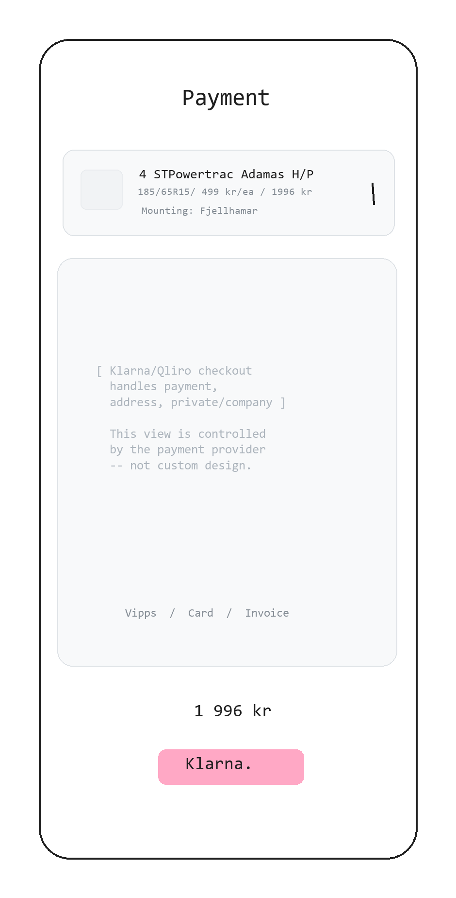

<!--
  NAVIGATION BEST PRACTICE: Navigation links appear in THREE places:
  1. Above the sketch (top)
  2. Below the sketch (still in header area)
  3. At document bottom
  This is intentional for long specifications - users should not need to
  scroll the entire document to navigate between pages.
-->

### 01.5-Payment

**Previous Step:** <- [01.4-Quantity & Shop](../01.4-quantity-and-shop/01.4-quantity-and-shop.md)
**Next Step:** -> [01.6-Book Mounting](../01.6-book-mounting/01.6-book-mounting.md)



**Previous Step:** <- [01.4-Quantity & Shop](../01.4-quantity-and-shop/01.4-quantity-and-shop.md)
**Next Step:** -> [01.6-Book Mounting](../01.6-book-mounting/01.6-book-mounting.md)

---

# 01.5-Payment

## Page Metadata

  Property   Value  
 ---------- ------- 
  **Scenario**   01: Harriet's Tire Purchase  
  **Page Number**   01.5  
  **Platform**   Mobile web (responsive)  
  **Page Type**   Full Page (external redirect)  
  **Viewport**   Controlled by payment provider  
  **Interaction**   Touch-first (provider UI)  
  **Visibility**   Public  

---

## Overview

**Page Purpose:** Hand off to Klarna/Qliro for payment. This is the "clean cut" between Sharif's frontend and the external payment system. Sharif's design ends here -- the payment provider controls the entire view.

**User Situation:** Harriet tapped "Betal na -- 1 996 kr" on the quantity/shop view. She has committed to buying. The page loads the payment provider's checkout UI.

**Success Criteria:** Harriet completes payment and is redirected back to Sharif's booking view (01.6).

**Entry Points:**
- CTA "Betal na" on 01.4-Quantity & Shop -> redirect to payment provider

**Exit Points:**
- Payment complete -> redirect to 01.6-Book Mounting (via return URL)
- Payment cancelled -> return to 01.4-Quantity & Shop
- Payment failed -> error state within provider UI, retry option

---

## Reference Materials

**Strategic Foundation:**
- [Product Brief](../../../A-Product-Brief/01-product-brief.md) - Vision, positioning, tone of voice
- [Trigger Map -- Harriet](../../../B-Trigger-Map/02-Harriet-the-Hairdresser.md) - Primary persona driving forces

**Related Pages:**
- [01.4-Quantity & Shop](../01.4-quantity-and-shop/01.4-quantity-and-shop.md) - Previous step, passes order data
- [01.6-Book Mounting](../01.6-book-mounting/01.6-book-mounting.md) - Return URL destination

**Design System:**
- [Design System](../../../D-Design-System/00-design-system.md) - Not applied (external provider UI)

---

## Layout Structure

External provider controls layout. Sharif does not design this view.

```
+----------------------------------+
  [Klarna/Qliro Header]              Provider branding
+----------------------------------+
                                    
   Order summary                      Passed from Sharif
   4x Powertrac Adamas H/P         
   185/65R15                        
   Total: 1 996 kr                  
                                    
+----------------------------------+
   Customer identification            Provider handles
   (BankID / email / phone)         
+----------------------------------+
   Payment method                     Provider handles
   (Card / Vipps / Invoice)         
+----------------------------------+
   [Private] [Company]                Provider handles
+----------------------------------+
   Delivery address                   Provider handles
+----------------------------------+
   [======== Pay now =========]       Provider CTA
+----------------------------------+
```

---

## Spacing

**Scale:** [Spacing Scale](../../../D-Design-System/00-design-system.md#spacing-scale)

  Property   Token  
 ---------- ------- 
  N/A   Controlled by payment provider  

---

## Typography

**Scale:** [Type Scale](../../../D-Design-System/00-design-system.md#type-scale)

  Element   Semantic   Size   Weight   Typeface  
 --------- ---------- ------ -------- ---------- 
  N/A   Controlled by payment provider   --   --   --  

---

## Page Sections

### Section: Payment Provider Checkout

**OBJECT ID:** `pay-checkout`

  Property   Value  
 ---------- ------- 
  Purpose   External checkout -- Klarna/Qliro controls entire UI  
  Component   [External embed or redirect](../../../D-Design-System/00-design-system.md#external-checkout-handoff)  
  Padding   Controlled by provider  
  Element gap   Controlled by provider  

---

#### Order Data Payload

**OBJECT ID:** `pay-order-data`

  Property   Value  
 ---------- ------- 
  Component   [Data object (passed to provider, not rendered by Sharif)](../../../D-Design-System/00-design-system.md#data-contract)  
  Product   Powertrac Adamas H/P 185/65R15  
  Quantity   4  
  Unit price   499 kr  
  Total   1 996 kr  
  Behavior   Sent via API to payment provider at checkout init  

#### Return URL

**OBJECT ID:** `pay-return-url`

  Property   Value  
 ---------- ------- 
  Component   [URL parameter (passed to provider)](../../../D-Design-System/00-design-system.md#return-url-parameter)  
  Success URL   `/booking?order={order-ref}` -> 01.6-Book Mounting  
  Cancel URL   `/checkout` -> 01.4-Quantity & Shop  
  Content   Includes order reference for booking view to display confirmation  

---

### Section: Provider-Handled Elements

**OBJECT ID:** `pay-provider-ui`

  Property   Value  
 ---------- ------- 
  Purpose   Customer identification, payment method, address -- all handled by provider  

---

#### Customer Identification

**OBJECT ID:** `pay-customer-id`

  Property   Value  
 ---------- ------- 
  Component   [Provider module](../../../D-Design-System/00-design-system.md#provider-module)  
  Content   BankID, email, or phone verification  

#### Payment Method Selection

**OBJECT ID:** `pay-method`

  Property   Value  
 ---------- ------- 
  Component   [Provider module](../../../D-Design-System/00-design-system.md#provider-module)  
  Content   Card, Vipps, invoice, installments  

#### Private/Company Toggle

**OBJECT ID:** `pay-customer-type`

  Property   Value  
 ---------- ------- 
  Component   [Provider module](../../../D-Design-System/00-design-system.md#provider-module)  
  Content   Private or company checkout -- handled natively by provider  

#### Address Collection

**OBJECT ID:** `pay-address`

  Property   Value  
 ---------- ------- 
  Component   [Provider module](../../../D-Design-System/00-design-system.md#provider-module)  
  Content   Name, address, phone -- populated by BankID or manual entry  

---

## Page States

  State   When   Appearance   Actions  
 ------- ------ ------------ --------- 
  Loading   Redirect initiated   Sharif loading indicator, then provider loads   Wait  
  Provider Active   Checkout loaded   Klarna/Qliro UI with order summary   Complete payment  
  Payment Success   Payment confirmed   Provider confirmation, then redirect to 01.6   Auto-redirect  
  Payment Failed   Card declined / error   Provider error message   Retry or change method  
  Payment Cancelled   User backs out   Provider cancel flow   Return to 01.4  

---

## Object Registry

  Object ID   Type   Description  
 ----------- ------ ------------- 
  `pay-checkout`   Section   External checkout container  
  `pay-order-data`   Data Object   Order details passed to provider  
  `pay-return-url`   URL Parameter   Success/cancel redirect URLs  
  `pay-provider-ui`   Section   Provider-controlled UI elements  
  `pay-customer-id`   Provider Module   Customer identification  
  `pay-method`   Provider Module   Payment method selection  
  `pay-customer-type`   Provider Module   Private/company toggle  
  `pay-address`   Provider Module   Address collection  

---

## Technical Notes

- This is NOT a custom-designed view. The payment provider (Klarna or Qliro) controls the entire UI.
- Sharif passes order data and return URLs via the provider's API at checkout initialization.
- The return URL must include an order reference so 01.6-Book Mounting can display confirmation details.
- For the POC, this can be a Klarna sandbox environment or a simulated checkout page.
- The visual break from Sharif's brand to the provider's UI is acceptable -- Harriet has made all her decisions. She is just paying.
- The redirect back to Sharif after payment must carry: order ID, product details, selected shop, and payment status.
- Consider webhook confirmation from provider to backend (not just client-side redirect) for order integrity.

---

## Open Questions

| # | Question | Context | Status |
|---|----------|---------|--------|
| 1 | Klarna or Qliro - which provider for POC? | Both support the Norwegian market. Klarna has sandbox support. | Open |
| 2 | Embedded checkout or full redirect? | Full redirect is the chosen pattern for POC and initial implementation because provider-owned UI remains outside Sharif control. | Resolved: full redirect |
| 3 | What order data format does the provider require? | Affects the API integration layer. | Open |

---

## Checklist

- [x] Page purpose clear
- [x] All Object IDs assigned
- [x] Components reference design system
- [x] Translations complete (NO/EN) -- N/A (external provider)
- [x] States documented
- [x] Conditional sections included where needed

---

**Previous Step:** <- [01.4-Quantity & Shop](../01.4-quantity-and-shop/01.4-quantity-and-shop.md)
**Next Step:** -> [01.6-Book Mounting](../01.6-book-mounting/01.6-book-mounting.md)

---

_Created using Whiteport Design Studio (WDS) methodology_
