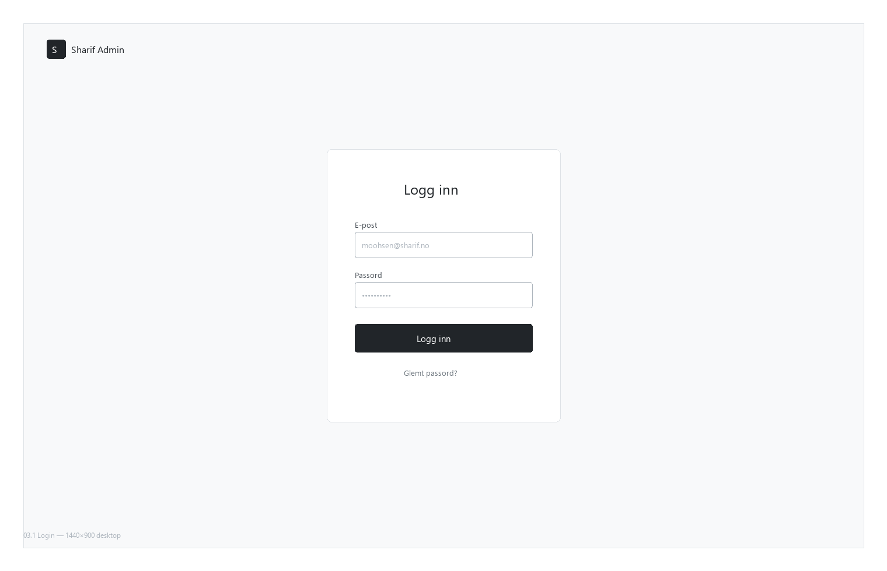

# 03.1 — Login

**Scenario:** [03 Admin Dashboard](../03-admin-dashboard.md)
**Previous:** — (entry point)
**Next:** [03.2 Open Glass Dashboard](../03.2-open-glass/03.2-open-glass.md)
**Status:** Wireframe approved

---

## What this screen does

Moohsen arrives at `localhost:9000/app`. He sees the Sharif-branded login screen, enters his credentials, and is taken directly to the Open Glass dashboard (03.2).

The moment login succeeds, the agent fires a personalised morning briefing — visible as the first message in the agent sidebar as the dashboard loads. It is not a blocking modal; it appears naturally in the sidebar as part of the transition.

---

## User actions

| Action | Result |
|--------|--------|
| Enter email + password | Authenticates via Medusa admin auth |
| Submit | Redirects to 03.2 Open Glass |
| Login success | Agent sidebar pre-loads with morning briefing |

---

## Data connections

| Table / API | Purpose |
|-------------|---------|
| Medusa `User` (admin) | Authentication — email + password |
| Medusa session / JWT | Session token stored in cookie for subsequent requests |

---

## Agent behaviour

On successful login the agent calls `getOrdersSummary(today)`, `getLowStockProducts(threshold)`, and `getEscalatedMessages()` in the background — results are composed into the morning briefing rendered in 03.2.

---

## User Scenarios

### Scenario A — Monday morning, first of the season

It is 07:58 on a Monday in late March. Moohsen parks in the lot behind Sharif Dekk and walks straight to his desk before taking off his jacket. He opens the laptop, navigates to the admin — muscle memory at this point — and types his email and password. The login screen is spare: Sharif logo, two fields, a button. He submits. The dashboard loads. Before he has time to look at the order list, a message appears in the sidebar: "God morgen, Moohsen. Det er 31 nye ordre siden i går — det er 22% mer enn samme mandag i fjor. 2 produkter er under minstebeholdning. 1 kundespørsmål venter på svar fra deg." He reads it once, leans back, and says out loud: "Bra."

### Scenario B — Wrong password on a busy Friday

Moohsen is already on the phone when he reaches his desk. He types his password fast, gets it wrong, dismisses the error, tries again. In under ten seconds he is in. No CAPTCHA, no lockout warning. He skips the morning briefing and navigates straight to Orders.

---

## Open questions

- [ ] Custom Sharif-branded login, or standard Medusa login with minimal styling?
- [ ] Single admin user (Moohsen only), or multi-user with roles?
- [ ] Should the agent greeting use the user's first name ("God morgen, Moohsen")?
