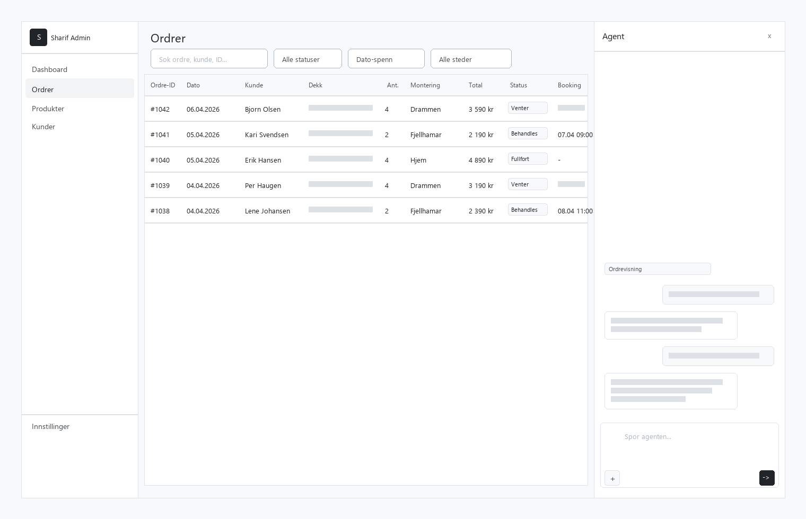

# 03.3 — Orders

**Scenario:** [03 Admin Dashboard](../03-admin-dashboard.md)
**Previous:** [03.2 Open Glass Dashboard](../03.2-open-glass/03.2-open-glass.md)
**Next:** [03.4 Products & Inventory](../03.4-products/03.4-products.md)
**Status:** Wireframe approved

---

## What this screen does

The full order list. Moohsen can browse, search, and filter all orders. Clicking an order opens a detail panel on the right (without leaving the list). The agent sidebar is available and context-aware — it knows he is on the Orders view and can answer natural language queries about the data he is looking at.

---

## User actions

| Action | Result |
|--------|--------|
| Search by name / email / order ID | Filters list in real time |
| Filter by status | Shows only: all / pending / processing / completed / cancelled |
| Filter by date range | Date picker, from–to |
| Filter by mounting location | Dropdown: Drammen / Fjellhamar / Home delivery |
| Filter by amount | Min–max NOK range |
| Click order row | Navigates to order detail page (03.3b) |
| Click customer name in detail | Navigates to customer profile in 03.5 |
| Ask agent "show orders from more than 100km away" | Agent calls `listOrders` + `calculateDistance`, returns filtered list |

---

## Order list columns

| Column | Source | Notes |
|--------|--------|-------|
| Order ID | `Order.display_id` | Short reference, e.g. #1042 |
| Date | `Order.created_at` | Formatted as DD.MM.YYYY HH:mm |
| Customer | `Order.customer.first_name + last_name` | Full name |
| Tires | `Order.items[].title` | Concatenated product names |
| Qty | `Order.items[].quantity` | Total units |
| Mounting | `Order.shipping_methods[].name` | Location or "Home delivery" |
| Total | `Order.total` | NOK formatted |
| Status | `Order.status` | Colour-coded badge |
| Booking | `Order.metadata.booking_time` | ISO datetime or "Not booked" |

---

## Order detail panel (right column)

Slides in when an order is clicked. Shows:

| Section | Fields | Source |
|---------|--------|--------|
| Header | Order ID, status badge, date | `Order` |
| Customer | Name, email, phone, address | `Order.customer` + `Order.shipping_address` |
| Distance | km from Drammen (auto-calculated) | `calculateDistance(shipping_address, "Drammen")` |
| Items | Tire name, dimension, qty, unit price, total | `Order.items` |
| Shipping | Method name, price | `Order.shipping_methods` |
| Mounting | Location, booked time | `Order.metadata.booking_*` |
| Payment | Method, status, amount | `Order.payments` |
| Notes | Internal notes (editable) | `Order.metadata.admin_notes` |

---

## Data connections

| Table / API | Purpose |
|-------------|---------|
| Medusa `Order` | All order data |
| Medusa `Customer` | Customer profile linked to order |
| Medusa `LineItem` | Products in the order |
| Medusa `ShippingMethod` | Delivery / mounting method |
| Medusa `Payment` | Payment status and method |
| Medusa `Address` | Shipping address for distance calculation |
| `Order.metadata` | Custom fields: `booking_time`, `booking_location`, `admin_notes` |

---

## Agent behaviour on this screen

Context injected: `"User switched to Orders view."`

Example queries the agent can handle:

| Query | Agent action |
|-------|-------------|
| "Vis ordre fra siste 7 dager" | Calls `listOrders({ date_from: -7d })` |
| "Hvilke ordre har ikke fått monteringstid?" | Calls `listOrders({ status: "pending" })`, filters by missing `booking_time` |
| "Vis ordre fra mer enn 100km unna Drammen" | Calls `listOrders()` + `calculateDistance()` for each, filters |
| "Hva er totalomsetningen denne uken?" | Calls `getOrdersSummary({ date_from: startOfWeek })` |
| "Finn ordre fra Erik Hansen" | Calls `listOrders({ search: "Erik Hansen" })` |
| "Kanseller ordre #1042" | Phase 2 — read-only in Phase 1 |

---

## User Scenarios

### Scenario A — Finding the order that never got a booking confirmation

It is 09:15. Bjørn Olsen from Sarpsborg called — says he placed an order three days ago but never heard back about his mounting appointment. Moohsen types "Bjørn Olsen" in the search field. The order appears: #1087, Continental VikingContact 7 215/60R16 × 4, mounting at Drammen, status: pending, booking_time empty. Moohsen asks the agent: "Hvilke ordre fra denne uken mangler monteringstid?" The agent returns six orders. He asks: "Kan du lage en liste med navn og e-post for disse seks?" The agent formats a clean list. Moohsen passes it to his assistant to call each customer.

### Scenario B — Checking if any large orders came from far away

Moohsen asks the agent: "Vis meg ordre fra mer enn 150km unna Drammen denne måneden." The agent calculates distances from each shipping address and returns four orders: Haugesund, Ålesund, Trondheim, and Tromsø. He laughs at the Tromsø order — four Michelin Pilot Sport 4S 255/40R19, home delivery, paid in full. He is satisfied the web presence is doing something.

### Scenario C — Daily status check before lunch

At 11:45 Moohsen filters orders to "Siste 24 timer" — 14 orders. He scans the status column: 11 processing, 2 completed, 1 still pending. The pending one: Per Haugen from Drammen, Pirelli Cinturato Winter 2 195/65R15, chose mounting at Drammen but has not confirmed a time. Moohsen makes a note to call him after lunch.

---

## Open questions

- [ ] Should Moohsen be able to edit orders (cancel, update status) in Phase 1, or read-only?
- [ ] Should internal admin notes be saved back to Medusa metadata?
- [ ] Distance calculation — use Google Maps API, a free geocoding API, or a simple postal code lookup table for Norway?
