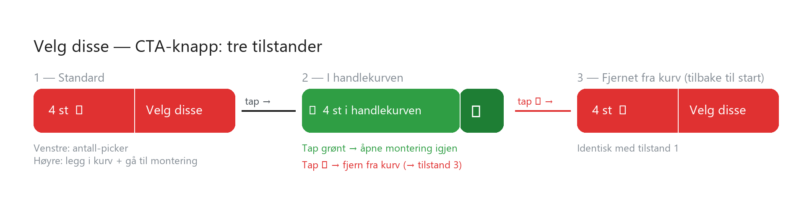

# Buy Button

**COMPONENT ID:** `mol-buy-button`
**Atomic Level:** Molecule (quantity display atom + action CTA atom, joined)
**Framework:** Next.js (sharif-server-storefront)
**Base Styling:** Tailwind utilities

---

## Purpose

The primary product purchase trigger across all Sharif product listing surfaces. Lets the user confirm their quantity and commit to purchase in a single component — one tap adds to cart and advances the flow.

The button is split into two joined tap targets: a quantity display on the left (shows selected quantity, tappable to change), and a purchase action on the right. After purchase, the component transitions to an in-cart state that both confirms the addition and provides a one-tap undo.

Used on any page that lists products — search results, store page, collections, related products.

---

## Anatomy

```
┌────────────────────────────────────────────┐
│  [ {qty} st ▾ ]  │  [ Velg disse ]        │
│   Quantity side  │  Action side            │
└────────────────────────────────────────────┘
         ↑ qty picker    ↑ cta atom
```

The two sides share equal height via `flex` but the action side takes more horizontal space (~60%).

---

## States

### State 1 — Default (idle)

The product has not been added to cart. Quantity defaults to 4 (the most common purchase).

```
┌─────────────────────────────────────────────┐
│  [ 4 st  ▾ ]  │      Velg disse            │
│   (red bg)    │       (red bg)              │
└─────────────────────────────────────────────┘
```

| Property | Value |
|----------|-------|
| Background | `bg-primary` (brand red), both sides |
| Text | `text-primary-content` (white) |
| Divider | Vertical 1px `border-primary-content/30` between sides |
| Quantity display | "{qty} st ▾" — current quantity + chevron-down |
| Action label | "Velg disse" |
| Behavior — qty side | onTap → open quantity picker (dropdown or bottom sheet) |
| Behavior — action side | onTap → add to cart + navigate to 01.4-Delivery and Mounting |

---

### State 2 — In cart (added)

The product is in the cart. The component confirms this and provides access to the next step or undo.

```
┌─────────────────────────────────────────────────┐
│  [ ✓  4 st i handlekurven ]  │  [ 🗑 ]          │
│       (green bg)             │  (dark green bg) │
└─────────────────────────────────────────────────┘
```

| Property | Value |
|----------|-------|
| Background — confirmation side | `bg-success` (green) |
| Background — trash side | `bg-success-dark` (darker green) |
| Text | `text-success-content` (white) |
| Confirmation label | "✓ {qty} st i handlekurven" |
| Trash icon | `🗑` (or icon: `trash-2`) |
| Behavior — confirmation side | onTap → navigate to 01.4-Delivery and Mounting (re-opens flow) |
| Behavior — trash side | onTap → remove from cart → transition to State 1 |

---

### State 3 — Removed from cart

Product removed via trash tap. Component returns immediately to State 1 (idle). No intermediate state needed.

---

### State: Unavailable

Product is out of stock. Action side is disabled, quantity side hidden.

```
┌─────────────────────────────────────────────┐
│           Ikke på lager                     │
│           (muted bg, no tap)                │
└─────────────────────────────────────────────┘
```

| Property | Value |
|----------|-------|
| Background | `bg-base-200` (muted) |
| Text | `text-base-content/50` |
| Behavior | Non-interactive. No tap target. |

---

## Sub-Components

### Quantity Side

**OBJECT ID:** `mol-buy-btn-qty`

| Property | Value |
|----------|-------|
| Element | `<button>` |
| Content | "{qty} st ▾" |
| Default quantity | 4 |
| Behavior | onTap → open quantity picker |
| Min width | ~80px (fits "4 st ▾" comfortably) |
| Min height | `touch-target-md` (44px) |

### Action Side

**OBJECT ID:** `mol-buy-btn-action`

| Property | Value |
|----------|-------|
| Element | `<button>` |
| Extends | [CTA Button](../atoms/cta-button.md) |
| Content | State-dependent (see translations below) |
| Behavior | State 1: add to cart + navigate. State 2: re-open flow. |
| Flex | `flex-1` — takes remaining width |
| Min height | `touch-target-md` (44px) |

### Trash Side (State 2 only)

**OBJECT ID:** `mol-buy-btn-trash`

| Property | Value |
|----------|-------|
| Element | `<button>` |
| Content | Trash icon (`trash-2`, 20px) |
| Behavior | onTap → remove from cart → transition to State 1 |
| Min width | `touch-target-md` (44px) |
| Min height | `touch-target-md` (44px) |
| aria-label | "Fjern fra handlekurv" / "Remove from cart" |

---

## Storyboard



---

## Translations

| Key | NO | EN |
|-----|----|----|
| `buyBtn.qty` | "{qty} st ▾" | "{qty} pcs ▾" |
| `buyBtn.action` | "Velg disse" | "Choose these" |
| `buyBtn.inCart` | "✓ {qty} st i handlekurven" | "✓ {qty} pcs in cart" |
| `buyBtn.remove` | "Fjern fra handlekurv" | "Remove from cart" |
| `buyBtn.unavailable` | "Ikke på lager" | "Out of stock" |

---

## Responsive Behavior

| Viewport | Behavior |
|----------|----------|
| **Mobile (< 768px)** | Full width of card. Qty side fixed width (~80px), action side flex-1. |
| **Tablet / Desktop** | Same proportions. Button height may reduce slightly. |

---

## Accessibility

| Requirement | Implementation |
|-------------|---------------|
| Both tap targets | Native `<button>` elements |
| Qty button label | `aria-label="Endre antall"` / `"Change quantity"` |
| Action button label | `aria-label="Velg disse — {product name}"` in State 1; `"Gå til montering"` in State 2 |
| Trash button | `aria-label="Fjern fra handlekurv"` |
| State change | `aria-live="polite"` on the component root — announces state transitions |
| Keyboard | All three tap targets reachable and activatable via keyboard |
| Touch target | All targets minimum 44px height |

---

## Technical Notes

- Component holds local `state: "idle" | "added"` — toggled by cart actions
- Cart operations call `addToCart` / `removeFromCart` server actions in `lib/data/cart.ts`
- After `addToCart` resolves: transition to `"added"` state and navigate to 01.4
- After `removeFromCart` resolves: transition to `"idle"` state
- If cart already contains this product on mount (e.g. after back-navigation): initialize in `"added"` state
- Quantity is passed as prop `initialQty` from the parent (product card or listing)
- The quantity picker interaction (opening a picker on qty tap) is left as a follow-up — for POC, qty is read-only display from parent

---

## Usage in Page Specs

Referenced as:

```markdown
| Component | [Buy Button](../../../D-Design-System/molecules/buy-button.md) |
```

Used in:
- [01.2-Product Cards](../../C-UX-Scenarios/01-harriets-tire-purchase/01.2-product-cards/01.2-product-cards.md) — primary checkout trigger on each card

---

_Created using Whiteport Design Studio (WDS) methodology_
